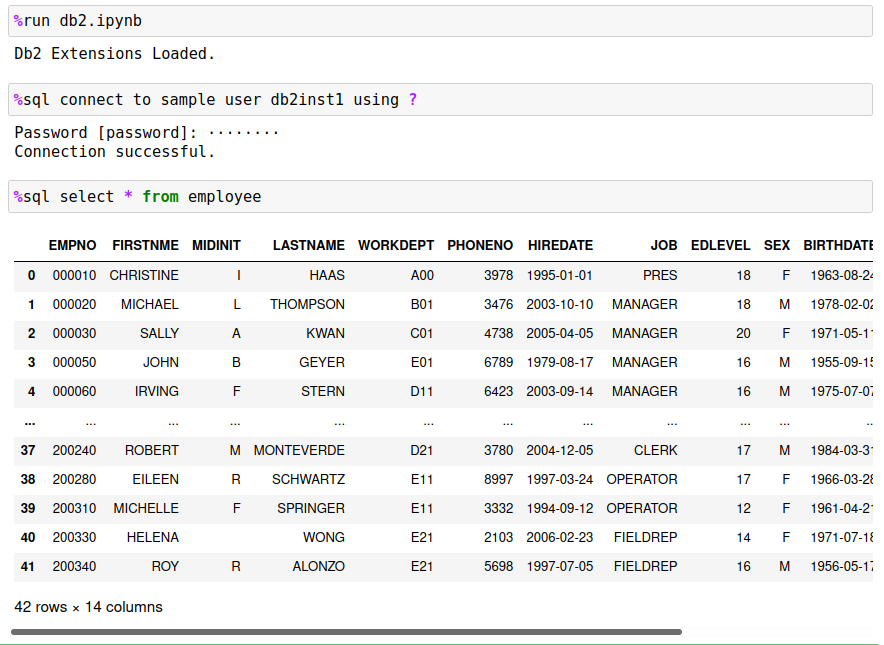

# Db2 Magic Command for Jupyter Notebooks

Jupyter notebooks include the ability to extend the syntax available within code blocks with a feature called [Magic](https://ipython.readthedocs.io/en/stable/interactive/magics.html) commands. Magic commands start with a percent sign `%` and provide a variety of features within a notebook environment, including modifying notebook behavior, executing OS commands, extending notebook functionality and with Db2 magic, a way of interacting with a Db2 database.

Once you have loaded the Db2 magic commands into your notebook, you are able to query Db2 tables using standard SQL syntax:



Db2 magic commands provide a number of features that will simplify your use of Db2 databases, including:

- Simplified connections to data sources
- Ability to store result sets into Pandas dataframes
- Create Db2 tables from Pandas dataframes and populate the tables with the data frame contents
- Run the majority of DCL, DDL, and DML statements that are available in Db2
- Create functions, stored procedures, and run a subset of administrative commands
- Allow for parallel execution of SQL queries even on non-warehousing systems
- And much more!

## Pre-requisites

If you are running on a Jupyter notebook service (Watson Studio), you may already have some of these pre-requisites installed. You can check to see if the Db2 libraries are installed by running the following command in a Jupyter notebook code cell:
```
import ibm_db
```

If the command returns sucessfully, then you do not need to install `ibm_db` and can continue to the *Loading Db2 Magic Commands* section.

If you have access to your Jupyter notebook environment, the Db2 Python client can be installed in one of three ways:

- `python3 -m pip install ibm_db` or `pip install ibm_db`
- `easy_install ibm_db`
- `conda install ibm_db` 

Prior to running the installation you may want to run these commands to ensure the proper libraries are available for the Db2 drivers:

- RHEL/CentOS `yum install python3-dev`
- Ubuntu `apt-get install python3-dev`

More detailed instructions can be found on the [Db2 Python Driver](https://github.com/ibmdb/python-ibmdb#inst) support page.

## Loading Db2 Magic Commands

Once you have `ibm_db` installed, you will need to download the Db2 magic commands. The Db2 magic commands can be downloaded and placed directly to the directory that your Jupyter notebooks are stored in, or can be downloaded from within a Jupyter notebook.

To load the Db2 magic commands into your notebook, run the following command in your Jupyter notebook:
```
!wget https://raw.githubusercontent.com/IBM/db2-jupyter/master/db2.ipynb
```

Once you have loaded the Db2 magic commands into your notebook, you are able to query Db2 tables using standard SQL syntax:
```
%run db2.ipynb
%sql connect to sample
%sql select * from employee
```

# Support

For any questions regarding the Db2 Magic commands, including any suggestions, general comments, or bug reports, please contact:

* George Baklarz `baklarz@ca.ibm.com`
* Phil Downey `phil.downey1@ibm.com`

George & Phil

### Acknowledgements

We would like to thank the following people who helped in early prototying, testing, suggestions, and feedback on the Db2 Magic commands.

* Peter Kohlmann
* Dean Compher

## Db2 Magic Commands Help

For more information on the Db2 Magic commands, refer the online [Db2 Magic Commands](https://ibm.github.io/db2-jupyter/) documentation. The
section below is a summary of a few key features in the product.

# DB2 Jupyter Notebook Extensions

This code is imported as a Jupyter notebook extension in any notebooks you create with DB2 code in it. Place the following line of code in any notebook that you want to use these commands with:
<pre>
&#37;run db2.ipynb
</pre>

This code defines a Jupyter/Python magic command called `%sql` which allows you to execute DB2 specific calls to 
the database. There are other packages available for manipulating databases, but this one has been specifically
designed for demonstrating a number of the SQL features available in DB2.

There are two ways of executing the `%sql` command. A single line SQL statement would use the
line format of the magic command:
<pre>
%sql SELECT * FROM EMPLOYEE
</pre>
If you have a large block of sql then you would place the %%sql command at the beginning of the block and then
place the SQL statements into the remainder of the block. Using this form of the `%%sql` statement means that the
notebook cell can only contain SQL and no other statements.
<pre>
%%sql
SELECT * FROM EMPLOYEE
ORDER BY LASTNAME
</pre>
You can have multiple lines in the SQL block (`%%sql`). The default SQL delimiter is the semi-column (`;`).
If you have scripts (triggers, procedures, functions) that use the semi-colon as part of the script, you 
will need to use the `-d` option to change the delimiter to an at "`@`" sign. 
<pre>
%%sql -d
SELECT * FROM EMPLOYEE
@
CREATE PROCEDURE ...
@
</pre>

The `%sql` command allows most DB2 commands to execute and has a special version of the CONNECT statement. 
A CONNECT by itself will attempt to reconnect to the database using previously used settings. If it cannot 
connect, it will prompt the user for additional information. 

The CONNECT command has the following format:
<pre>
%sql CONNECT TO &lt;database&gt; USER &lt;userid&gt; USING &lt;password | ?&gt; HOST &lt;ip address&gt; PORT &lt;port number&gt; [SSL &lt;filename&gt;]
</pre>
If you use a "`?`" for the password field, the system will prompt you for a password. This avoids typing the 
password as clear text on the screen. If a connection is not successful, the system will print the error
message associated with the connect request.

If the connection is successful, the parameters are saved on your system and will be used the next time you
run a SQL statement, or when you issue the %sql CONNECT command with no parameters.

In addition to the -d option, there are a number different options that you can specify at the beginning of 
the SQL:

   - `-d, -delim` - Change SQL delimiter to "`@`" from "`;`"
   - `-q, -quiet` - Quiet results - no messages returned from the function
   - `-r, -array` - Return the result set as an array of values instead of a dataframe
   - `-j` - Format the first character column of the result set as a JSON record
   - `-json` - Return result set as an array of json records
   - `-a, -all` - Return all rows in answer set and do not limit display
   - `-grid` - Display the results in a scrollable grid
   - `-e, -echo` - Any macro expansions are displayed in an output box 

<p>
You can pass python variables to the `%sql` command by using the `{}` braces with the name of the
variable inbetween. Note that you will need to place proper punctuation around the variable in the event the
SQL command requires it. For instance, the following example will find employee '000010' in the EMPLOYEE table.
<pre>
empno = '000010'
%sql SELECT LASTNAME FROM EMPLOYEE WHERE EMPNO='{empno}'
</pre>

The other option is to use parameter markers. What you would need to do is use the name of the variable with a colon in front of it and the program will prepare the statement and then pass the variable to Db2 when the statement is executed. This allows you to create complex strings that might contain quote characters and other special characters and not have to worry about enclosing the string with the correct quotes. Note that you do not place the quotes around the variable even though it is a string.

<pre>
empno = '000020'
%sql SELECT LASTNAME FROM EMPLOYEE WHERE EMPNO=:empno
</pre>

## Development SQL
The previous set of `%sql` and `%%sql` commands deals with SQL statements and commands that are run in an interactive manner. There is a class of SQL commands that are more suited to a development environment where code is iterated or requires changing input. The commands that are associated with this form of SQL are:
- AUTOCOMMIT
- COMMIT/ROLLBACK
- PREPARE 
- EXECUTE

Autocommit is the default manner in which SQL statements are executed. At the end of the successful completion of a statement, the results are commited to the database. There is no concept of a transaction where multiple DML/DDL statements are considered one transaction. The `AUTOCOMMIT` command allows you to turn autocommit `OFF` or `ON`. This means that the set of SQL commands run after the `AUTOCOMMIT OFF` command are executed are not commited to the database until a `COMMIT` or `ROLLBACK` command is issued.

`COMMIT` (`WORK`) will finalize all of the transactions (`COMMIT`) to the database and `ROLLBACK` will undo all of the changes. If you issue a `SELECT` statement during the execution of your block, the results will reflect all of your changes. If you `ROLLBACK` the transaction, the changes will be lost.

`PREPARE` is typically used in a situation where you want to repeatidly execute a SQL statement with different variables without incurring the SQL compilation overhead. For instance:
```
x = %sql PREPARE SELECT LASTNAME FROM EMPLOYEE WHERE EMPNO=?
for y in ['000010','000020','000030']:
    %sql execute :x using :y
```
`EXECUTE` is used to execute a previously compiled statement. 

To retrieve the error codes that might be associated with any SQL call, the following variables are updated after every call:

* SQLCODE
* SQLSTATE
* SQLERROR - Full error message retrieved from Db2