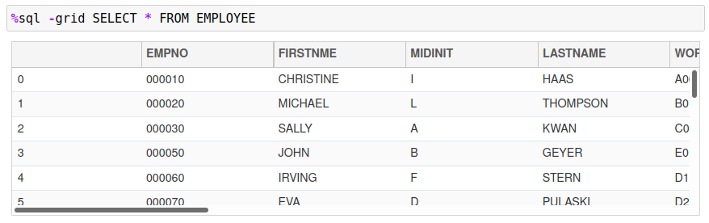
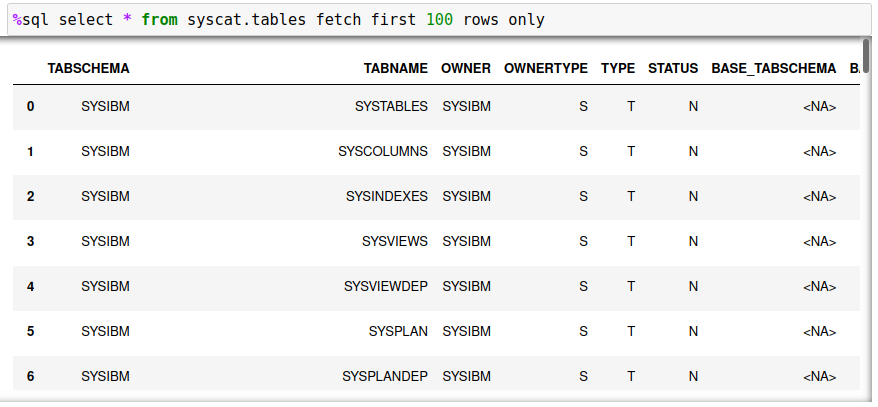

# Db2 Magic Options

The previous section discussed options that are specific for `%sql` commands and are only valid during the execution of that statement. There are options available that impact the execution of the `%sql` statements and are discussed below.

There are four options that can be set with the `%sql` command. These options are shown below with the default value shown in parentheses.

* DISPLAY PANDAS | GRID (PANDAS)

    Display the results as a PANDAS dataframe (default) or as a scrollable GRID.
    <p>

*  MAXROWS n (10)

    The maximum number of rows that will be displayed before summary information is shown. If the answer set is less than this number of rows, it will be completely shown on the screen. If the answer set is larger than this amount, only the first 5 rows and last 5 rows of the answer set will be displayed. If you want to display a very large answer set, you may want to consider using the grid option `-grid` to display the results in a scrollable table. If you really want to show all results, then setting `MAXROWS` to `-1` will return all output.
    <p>

* MAXGRID n (5)

    The maximum size of a grid display. When displaying a result set in a grid `-grid`, the default size of the display window is 5 rows. You can set this to a larger size so that more rows are shown on the screen. Note that the minimum size always remains at `5` which means that if the system is unable to display your maximum row size it will reduce the table display until it fits.
    <p>

* LIST
    Display the current settings.
    <p>

To set an option use either of the following commands:
```
%sql SET OPTION value
%sql OPTION setting value [setting value...]
```

The `OPTION` command allows multiple options to be set with one command. When either command is executed, the current settings are displayed.


For instance, to set the maximum display rows to 100:
```
%sql SET MAXROWS 100
```

## Display Format

The default display format for any data returned is Pandas. This example illustrates the standard output returned from a `SELECT` statement:


The Pandas output format will sometimes truncate the output (as shown above). You can adjust the number of rows that can be displayed from an answer set using the `MAXROWS` setting discussed below. This standard output may be sufficient for your requirements if you are only returning small answer sets (less than 100 rows to display). Otherwise, you may consider using the `-grid` option. The same answer set using a `-grid` display is shown below.



The advantage of the `-grid` option is that the entire answer set can be retrieved and reviewed in the scrollable window. This is not possible when using Pandas output. It is also not possible to display all rows in the Pandas dataframe due to memory limitations when writing to a Jupyter notebook cell. The grid control removes these restrictions by allowing the entire answer set to be viewed in a grid format.

The `DISPLAY` option is used to set the default display format of an SQL answer set. The default setting is `PANDAS` which is the standard output format of a Pandas dataframe. To change the default display format use the `SET` command with the `DISPLAY` option:
```
%sql SET DISPLAY [PANDAS | GRID]
```

Setting this value to `GRID` will result in all answer sets being displayed using the interactive grid format.
```
%sql SET DISPLAY GRID
```

The display format is kept with the connection information. If you start up another session using the same connection information, the last display format will be used.

## Maximum Number of Rows

The default number of rows that are displayed when using a Pandas dataframe is 10. An answer set will always display the first 5 rows and the last 5 rows of an answer set in a Jupyter notebook:


The missing rows are marked with a `...` in-between the top and bottom sections of the answer set. To increase the **default** display size, you can change the `MAXROWS` setting. The rows that are displayed depends on how many can fit within the `MAXROWS` settings. The rules are as follows:

* If the number of rows is less than or equal to `MAXROWS`, then all rows will be displayed.
* If the number of rows is greater than `MAXROWS` then only the top and bottom 5 rows are displayed.
* If `MAXROWS` is too big for a Jupyter notebook cell, the cell will contain scroll bars allowing you to scroll through the results.

The maximum value for `MAXROWS` is `100` to avoid memory issues with Jupyter notebooks. 

For the following examples, the `MAXROWS` setting is set to `5`.
```
%sql SET MAXROWS 5
```

The first example demonstrates when exactly 5 rows are returned from the `EMPLOYEE` table.


The next example demonstrates how the answer set is split when the number of rows exceeds 5.


If maximum value of `MAXROWS` is 100. As many rows possible will be displayed in the notebook. If the number of rows is too large, the cell will contain scrollbars so that you can see all rows that are returned.



If you want to scroll through large answer sets, you should consider using the `-grid` flag or set the `DISPLAY` option.

## Maximum Grid Size

The grid control displays approximately 5 lines of data in a Jupyter notebook cell. The `MAXGRID` option can be used to change the number of rows that the grid control will display in a Jupyter notebook cell. The entire answer set can be reviewed using the scroll bars on the right side and bottom of the control.

The following is the default view of the grid control.


To change the number of rows displayed, use the `MAXGRID` option:
```
%sql SET MAXGRID 10
```

The answer set will now display a minimum of 10 rows in the grid.


Note that the `MAXGRID` option does not affect the number of rows that are returned in an answer set.

## Thread Parallelism

The Db2 magic commands have the ability to split a SQL statement into multiple threads to improve the time it takes to retrieve answer sets. This feature does not make Db2 more efficient - it provides a way to increase the utilization of Db2 and pipeline SQL statements so that less time is spent waiting for data to be retrieved. The section on parallelism explores this feature in more detail.

The `THREADS` option tells Db2 the maximum of threads that it will be allowed to use when running the SQL. The SQL will be split (based on some range or key) and multithreaded into Db2. The `THREADS` value can be anything from zero (standard SQL call) to 12. The highest performance was found to occur when using 6 to 8 threads, but this will be entirely dependent on the SQL workload. 

To set the number of threads use the following syntax:
```
%sql SET THREADS 0-12
```

The `THREADS` option does not apply to standard SQL statements. This option will only be used when the `USING x SELECT...` syntax is detected in a `%sql` or `%%sql` block.
