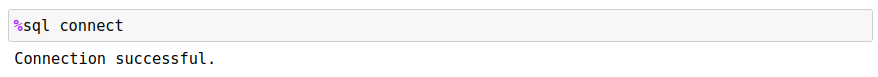
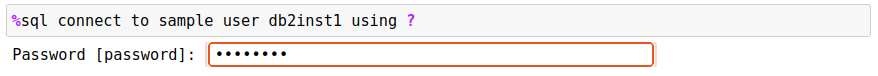

# Connecting to Db2

Before any SQL commands can be issued, a connection needs to be made to the Db2 database that you will be using. The connection can be done manually (through the use of the CONNECT command), or automatically when the first `%sql` command is issued.

The Db2 magic command tracks whether a connection has occurred in the past and saves this information between notebooks and sessions. When you start up a notebook and issue a command, the program will reconnect to the database using your credentials from the last session. In the event that you have not connected before, the system will require that you execute the `CONNECT` command. To connect to a Db2 database you will need the following information:

  * Database name 
  * Hostname 
  * Db2 port number
  * Userid
  * Password

You may also require two additional pieces of information:

  * SSL Security - Request that SSL connections be used with Db2 and optionally the location of the SSL file that contains required certificate information
  * SSL File - The certificate file (if required)
  * API Key - An API key that is provided to connect to Db2
  * Access Token - An access token that is provided to connect to Db2
  * DSN - A string that contains the ODBC connection string 

The information supplied will be stored in the directory that the notebooks are stored on. Once you have entered the information, the system will attempt to connect to the database for you, and then you can run all SQL scripts. More details on the `CONNECT `syntax will be found in a section below.

If you have credentials available from Db2 on Cloud or CP4D, place the contents of the credentials into a variable and then use the `CONNECT CREDENTIALS <var>` syntax to connect to the database.
```
db2blu = { "uid" : "xyz123456", ...}
%sql CONNECT CREDENTIALS db2blu
```

If the connection is successful using the credentials, the variable will be saved to disk so that you can connect from within another notebook using the same syntax.

## Connect Syntax

The `CONNECT` command has four different options that are listed below. You must explicitly connect to a Db2 database for the first time. Subsequent connections are **not** required if you are connecting to the same database. When the Db2 magic command executes your SQL command, it checks to see whether you have already connected to the database. If not, it will check to see if there was a successful connection previously and will use those credentials to reconnect.

You can also force a connection to the previous database by issuing the `CONNECT` command with no parameters.



### Standard Connection

The format of the `CONNECT` command is:
```
%sql CONNECT TO database USER userid USING password | ? 
                HOST ip_address PORT port_number 
                [ SSL ] [ SSLFILE file ] [ APIKEY key ] [ ACCESSTOKEN token ] 
                [ DNS "string" ]
```

The required fields are:

  * Database - Database name you want to connect to
  * Hostname - `localhost` if Db2 is running on your own machine or the IP address or symbolic name of the server
  * PORT - The port to use for connecting to Db2. This is usually 50000. 

When connecting using an apikey or access token, you will need to provide the key value after the keyword. The SSL security settings are already preconfigured when using these settings.

  * APIKEY value - the value of the APIKEY 
  * ACCESSTOKEN value - the value of the access token

If not using APIKEY/ACCESSTOKEN, you will need to provide your credentials to connect:

  * Userid - The userid to use when connecting to the database.
  * Password - The password for the userid. Use a question mark `?` to be prompted to enter the password without displaying the text.

There are two optional fields. The SSL option ensures that the transmission of the SQL and answer sets are encrypted "on the wire". SSL is typically required when using public networks to communicate to a Db2 database. For internal systems this may not be the case. If you are required to use SSL communication, you must specify `SSL` in the connection string. The use of an SSL port on Db2 (traditionally 50001) may require a certificate file.

If your workstation has already been configured to use SSL communication, then only the `SSL` parameter is required. If you have been given access to a Db2 database and have been provided with an SSL certificate, then you will use the `SSLFILE` option. The certificate option requires the location and name of the file that contains the `SSL` certificate which is used for communicating with Db2. Normally this certificate would have been provided to you and placed onto your local file system.

The format of the `SSLFILE` certificate option is `SSLFILE filename` where `filename` is the fully qualified location of the SSL file. You do not need to specify `SSL` as part of the connection string since it is assumed that you will be using `SSL` communication when you supply a certificate file. 

```
%sql CONNECT TO BLUDB USER BLUADMIN USING ? HOST 145.23.24.1 PORT 50001 SSLFILE /ssl/bludb.cert
```

If you want to use an ODBC connection string, rather than using the CONNECT syntax, you can supply it by using the DSN option.

* DSN "dsn string"

The value in the `"dsn string"` will be passed to the connect routine without modification. A sample DSN string is found below:

```
dsn = "DRIVER={IBM DB2 ODBC DRIVER};DATABASE=BLUDB;HOSTNAME=some.random.location.com;PORT=12345;PROTOCOL=TCPIP;ConnectTimeout=15;LONGDATACOMPAT=1;AUTHENTICATION=GSSplugin;SECURITY=SSL;APIKEY=lKJH896HUGY102938unad9eYtw;"

%sql CONNECT DSN "{dsn}"
```

Note how the DSN string must be surrounded in quotes in the `CONNECT` command.

Details of all Db2 CLI settings can be found in the [Db2 ODBC/CLI documentation](https://www.ibm.com/docs/en/db2/11.5?topic=odbc-cliodbc-configuration-keywords).


### Passwords

If you use a `?` for the password field, the system will prompt you for a password. This avoids typing the password as clear text on the screen. If a connection is not successful, the system will print the error message associated with the connect request.



### Connection with Credentials

The `CREDENTIALS` option allows you to use credentials that are supplied by Db2 on Cloud instances. The credentials can be supplied as a variable and if successful, the variable will be saved to disk for future use. If you create another notebook and use the identical syntax, if the variable is not defined, the contents on disk will be used as the credentials. You should assign the credentials to a variable that represents the database (or schema) that you are communicating with. Using familiar names makes it easier to remember the credentials when connecting. 

Credentials must be supplied as a JSON dictionary that contains the following information:
```
{
  "database"    : "bludb",
  "hostname"    : "somesite-txn-blue.net",
  "port"        : 50000,
  "pwd"         : "somethingrandom",
  "uid"         : "myuserid",
  "ssl"         : "SSL",
  "sslfile"     : "filename",
  "apikey"      : "apikey",
  "accesstoken" : "accesstoken",
  "dsn"         : "dsn"
}
```
Some of these fields are not necessary. For instance, the apikey, accesstoken, and dsn fields are only required if you are using these forms of connections.

To use this as a connection document, assign this dictionary value to a variable:
```
bludb = {
  "hostname": "somesite-txn-blue.net",
  "pwd": "somethingrandom",...
}
```

Then use the following syntax to connect to the database:

```
%sql CONNECT CREDENTIALS bludb
```

The system will attempt to connect to the database using the following process:

  1. If the `bludb` variable exists in your Jupyter notebook, it will use the contents of that variable to connect to the database.
  2. If `bludb` does not exist, the program will check the local directory that the notebook is in to find a file called `bludb.pickle` which contains the credentials.
  3. If neither of the above exist the program will issue a connection error.

If a connection was successfully made, the credentials are written to disk using the name of the variable as the file name and the file type being `pickle`. A `pickle` file is a Python format that allows structures and data types to be written to a file and easily read back in. 

Note that if you want to use the traditional `CONNECT` syntax, you can extract the values required from the credentials file. You will need the following:

  * `db` - Database name
  * `uid`  - Connection userid
  * `pwd`  - Connection password
  * `hostname`  - Host
  * `port`      - Port number
  * `SSL`       - Add this keyword if you need to connect via SSL

### Closing a Connection

`CONNECT CLOSE` will close the current connection, but will not reset the database parameters. This means that if you issue the `CONNECT` command again, the system will reconnect you to the database.
```
%sql CONNECT CLOSE
```

If you issue another SQL statement after closing the connection, the program will reconnect to last database you were connected to. If you don't want this behavior, use the `CONNECT RESET` command.

### Resetting a Connection

`CONNECT RESET` will close the current connection and remove any information on the connection. You will need to issue a new `CONNECT `statement with the connection information. 
```
%sql CONNECT RESET
```

Issuing a SQL statement after a `CONNECT RESET` will result in a connection error. 

### Debugging Connection Strings

If you need to see the connection string that is generated by the `CONNECT` command, use the `-e` flag as part of the connection:
```
%sql -e connect to sample user db2inst1 using db2inst1
DRIVER={IBM DB2 ODBC DRIVER};DATABASE=SAMPLE;HOSTNAME=localhost;PORT=50000;UID=db2inst1;PWD=db2inst1;PROTOCOL=TCPIP;ConnectTimeout=15;LONGDATACOMPAT=1;
```

The program will **not** attempt to connect to the database, but will print the connection string that it was going to use. You can then modify this string to include any optional settings you require and then use the `DSN` option on the connect command to force the DSN value to be used instead of what the Db2 Magic command generates.
```
dsn = "DRIVER={IBM DB2 ODBC DRIVER};UID=db2inst1;DATABASE=BLUDB;PWD=password;HOSTNAME=some.random.location.com;PORT=12345;"

%sql CONNECT DSN "{dsn}"
```