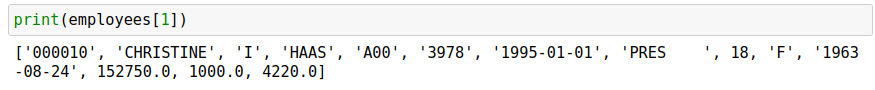
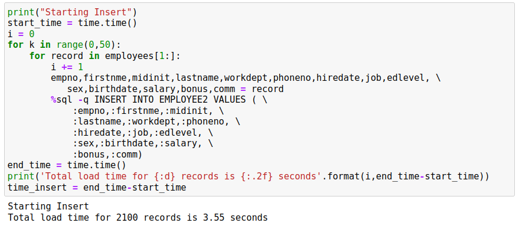
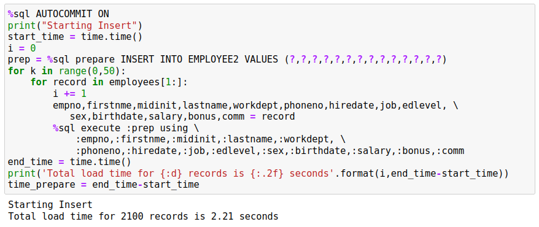
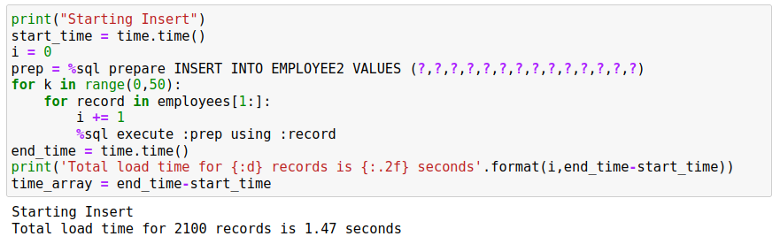
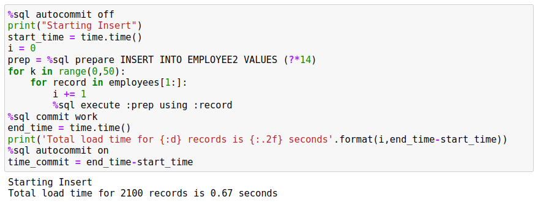
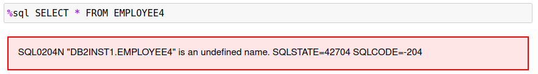
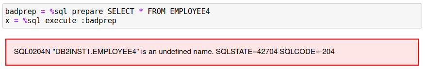
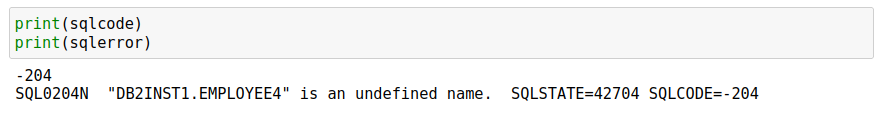

# Development SQL

The `%sql` and `%%sql` commands deals with SQL statements and commands that are run in an interactive manner. There is a class of SQL commands that are more suited to a development environment where code is iterated or requires changing input. The commands that are associated with this form of SQL are:

* `AUTOCOMMIT`
* `COMMIT`/`ROLLBACK`
* `PREPARE`
* `EXECUTE`

In addition, the `sqlcode`, `sqlstate` and `sqlerror` fields are populated after every statement so you can use these variables to test for errors.

Autocommit is the default manner in which SQL statements are executed. At the end of the successful completion of a statement, the results are commited to the database. There is no concept of a transaction where multiple DML/DDL statements are considered one transaction. The `AUTOCOMMIT` command allows you to turn autocommit `OFF` or `ON`. This means that the set of SQL commands run after the `AUTOCOMMIT OFF` command are executed are not commited to the database until a `COMMIT` or `ROLLBACK` command is issued.

`COMMIT (WORK)` will finalize all of the transactions (COMMIT) to the database and `ROLLBACK` will undo all of the changes. If you issue a `SELECT` statement during the execution of your block, the results will reflect all of your changes. If you `ROLLBACK` the transaction, the changes will be lost.

`PREPARE` is typically used in a situation where you want to repeatidly execute an SQL statement with different variables without incurring the SQL compilation overhead. For instance:
```
x = %sql PREPARE SELECT LASTNAME FROM EMPLOYEE WHERE EMPNO=?
for y in ['000010','000020','000030']:
    %sql execute :x using :y
```

`EXECUTE` is used to execute a previously compiled statement.

## Autocommit and Commit Scope

By default, any SQL statements executed with the %sql magic command are immediately committed. This means that the log file has the transaction details, and the results are committed to disk. In other words, you can't change your mind after the statement finishes execution.

This behavior is often referred to as `AUTOCOMMIT` and adds a level of overhead to statement execution because at the end of every statement the results must be "hardened". On the other hand, autocommit means you don't have to worry about explicitly committing work or causing potential locking issues because you are holding up resources. When a record is updated, no other user will be able to view it (unless using "dirty read") until you commit. Holding the resource in a lock means that other workloads may come to a halt while they wait for you to commit your work.

Here is a classic example of wanting a commit scope that is based on a series of statements:
```
withdrawal = 100
%sql update checking set balance = balance - withdrawal
%sql update savings set balance = balance + withdrawal
```

If autocommit is `ON,` you could have a problem with the transaction if the system failed after the first update statement. You would have taken money out of the checking account, but have not updated the savings account. To make sure that this transaction is run successfully:
```
%sql autocommit off
withdrawal = 100
%sql update checking set balance = balance - withdrawal
%sql update savings set balance = balance + withdrawal
%sql commit work
```

If the transaction fails before the `COMMIT WORK`, all changes to the database will be rolled back to its original state, thus protecting the integrity of the two tables.

### AUTOCOMMIT

Autocommit can be turned on or off using the following syntax:
```
%sql AUTOCOMMIT ON | OFF
```

If you turn `AUTOCOMMIT OFF` then you need to make sure that you `COMMIT` work at the end of your code. If you don't there is possible you lose your work if the connection is lost to Db2.

### COMMIT, ROLLBACK

To `COMMIT` all changes to the database you must use the following syntax:
```
%sql COMMIT [WORK | HOLD]
```

The command `COMMIT` or `COMMIT WORK` are identical and will commit all work to the database. Issuing a `COMMIT` command also closes all open cursors or statements that are open. If you had created a prepared statement (see section below) then the compiled statement will be no longer valid. By issuing a `COMMIT` you are releasing all of the resources and locks that your application may be holding.

`COMMIT HOLD` will allow you to commit your work to disk, but keeps all of the resources open for further execution. This is useful for situations where you are inserting or updating 1000's of records and do not want to tie up log space waiting for a commit to occur. The following pseudocode gives you an example how this would be used:
```
%sql autocommit off
for i = 1 to 1000
    %sql insert into x values i
    if (i / 100 == 0) 
       print i "Records inserted"
       %sql commit work
    end if 
end for
%sql commit work
%sql autocommit on
```

You should always remember to turn `AUTOCOMMIT ON` at the end of any code block or you will have to issue `COMMIT` at the end of any SQL command to commit it to the database.

## PREPARE and EXECUTE

The `PREPARE` and `EXECUTE` commands are useful in situations where you want to repeat an SQL statement multiple times while just changing the parameter values. There isn't any benefit from using these statements for simple tasks that may only run occasionally. The benefit of `PREPARE` and `EXECUTE` is more evident when dealing with a large number of transactions that are the same.

The `PREPARE` statement can be used against many types of SQL, but in this implementation, only the following SQL statements are supported:

* `SELECT`
* `INSERT`
* `UPDATE`
* `DELETE`
* `MERGE`

To prepare a statement, you must use the following syntax:
```
stmt = %sql PREPARE sql ....
```
The `PREPARE` statement always returns a statement handle. You must assign the results of the `PREPARE` statement to a variable since it will be required when you `EXECUTE` the statement.

The SQL statement must have any variables replaced with a question mark `?`. For instance, if you wanted to insert a single value into a table you would use the following syntax:
```
stmt = %sql PREPARE insert into x values (?)
```

One important note with parameter markers. If you require the parameter to have a specific data type (say INTEGER) then you may want to place a `CAST` statement around it to force the proper conversion. Usually strings, integers, decimals, etc., convert fine when using this syntax, but occasionally you may run across a data type issue. For the previous example we could modify it to:
```
stmt = %sql PREPARE insert into x values (CAST(? AS INTEGER))
```

Once you have prepared a statement, you can execute it using the following syntax:
```
%sql EXECUTE :stmt USING :v1,:v2,:v3,....
```

You must provide the statement variable `:stmt` to the `EXECUTE` statement so it knows which prepared code to execute. You can create many prepared statements and use them throughout your code.

The values that following the `USING` clause are either constants or SQL host variable names separated by commas. If you place a colon `:` in front of a variable name, it will be immediately substituted into the statement:
```
%sql EXECUTE :stmt USING 3,'asdsa',24.5,:x,x
```

Variables without a colon in front of them are linked in dynamically. When the `EXECUTE` statement is processed, the value in the variable is taken directly from memory so there is no conflict with data type, quotes, or anything that might be interpreted incorrectly. In the sample above we have the same variable specified twice:
```
:x,x
```

Assuming that `x` has a value of "Hello", when the statement is compiled, it will look like:
```
EXECUTE 0x7f2ef37782d0 USING 3,'asdsa',24.5,'Hello',x
```

The contents of `:stmt` and `:x` are placed into the string and then the statement is executed. The variable `x` is left as is. When execution of the prepared statement occurs, the value of the variable `x` is linked directly to the SQL statement so that the data is retrieved directly from the variable rather than it being materialized in the SQL statement. You can use either format when creating your statements. There is a performance penalty when using the `:var` format since the value must be materialized into the SQL statement, and then parsed again. 


When using linked variables you can specify what the underlying data type is so that Db2 does not try to incorrectly translate a value. The previous section mentioned the use of the `CAST` function to ensure the proper data type is used. With linked variables, you can specify four types of data:

* `char` - character data type (default)
* `bin`, `binary` - binary data
* `dec`, `decimal` - decimal data type
* `int`, `integer` - numeric data type

These modifiers are added after the variable name by using the `@` symbol:
```
%sql EXECUTE :stmt USING v1@int, v2@binary, v3@decimal
```

The default is to treat variables as character strings.

### Using Arrays and Multiple Parameters

When using the `PREPARE` statement, it can become cumbersome when dealing with many parameter markers. For instance, in order to insert 10 columns into a table the code would look similar to this:
```
stmt = %sql PREPARE INSERT INTO X VALUES (?,?,?,?,?,?,?,?,?,?)
```

The `%sql` command allows you to use the short form `?*#` where `#` is an integer representing the number of columns you want in the list. The above statement could be written as:
```
stmt = %sql PREPARE INSERT INTO X VALUES (?*10)
```

The syntax can also be used to create groups of parameter markers:
```
stmt = %sql PREPARE INSERT INTO X VALUES (?*3,?*7)
```

While this may seem a strange way of providing parameters, this becomes more useful when we use the `EXECUTE` command.

The `EXECUTE` command can use Python arrays (lists) as input arguments. For the previous example with 10 parameters you could issue the following command:
```
%sql EXECUTE :stmt USING :v1,:v2,:v3,:v4,:v5,:v6,:v7,:v8,:v9,:v10
```

If you placed all of these values into an array, you could also do the following:
```
%sql EXECUTE :stmt USING :v[0],:v[1],:v[2],:v[3],:v[4],:v[5],:v[6],:v[7],:v[8],:v[9]
```

That isn't much simpler but shows that you could use items within an array (one dimensional only). The easiest syntax is:
```
%sql EXECUTE :stmt USING :v
```

The only requirement is that the array `v` has exactly the number of values required to satisfy the parameter list required by the prepared statement.

When you split the argument list into groups, you can use multiple arrays to contain the data. Given the following prepare statement:
```
stmt = %sql PREPARE INSERT INTO X VALUES (?*3,?*7)
```

You could execute the statement using two arrays:
```
%sql EXECUTE :stmt USING :name, :details
```
This would work as long as the total number of parameters supplied by the name array and details array is equal to 10.

## Performance Comparisons

The following examples will show the use of `AUTOCOMMIT` and `PREPARE`/`EXECUTE` when running SQL statements.

This first SQL statement will load the `EMPLOYEE` and `DEPARTMENT` tables (if they don't already exist) and then return an array of all of the employees in the company using a `SELECT` statement. The data is returned as a Python list (array) with the `-r` option.
```
%sql SAMPLEDATA
employees = %sql -r select * from employee
```

The employees variable contains all of the employee data as a Python array. The next statement will retrieve the contents of the first row only (Remember that row 0 contains the name of the columns).


We now will create another EMPLOYEE table that is an exact duplicate of what we already have.
```
%%sql -q
DROP TABLE EMPLOYEE2;
CREATE TABLE EMPLOYEE2 AS (SELECT * FROM EMPLOYEE) DEFINITION ONLY;
```

### Loop with INSERT Statements

One could always use SQL to insert into this table, but we will use a loop to execute insert statements. The loop will be timed so we can get a sense of the cost of running this code. In order to make the loop run bit a longer the insert block is run 50 times.



### Loop with PREPARE Statement

An alternative method would be to use a prepared statement that allows us to compile the statement once in Db2 and then reuse the statement in Db2's memory. This method uses the individual column values as input into the `EXECUTE` statement.



Note that this code is run with `AUTOCOMMIT OFF` which tells Db2 to commit every `INSERT` statement. Using `AUTOCOMMIT OFF` results in a lot of additional overhead when running this code.

### Loop with PREPARE Statement and Arrays

You will notice that it is a bit tedious to write out all of the columns that are required as part of an `INSERT `statement. A simpler option is to use a Python list or array to and assign it directly in the EXECUTE statement. So rather than:
```
%sql execute :prep using :empno, :firstnme, ...
```

We can just use the array variable generated as part of the for loop:
```
%sql execute :prep using :record
```

The following SQL demonstrates this approach.



### Loop with PREPARE Statement, Arrays and AUTOCOMMIT OFF

Finally, we can turn `AUTOCOMMIT` off and then commit the work at the end of the block to improve the total time required to insert the data. Note the use of the parameter short form `?*14` in the code.


### Performance Comparison

You may have noticed that the performance of the last method is substantially faster than the other examples. The primary reason for this is the `COMMIT` only occurring at the end of the code.

| Run | Elapsed Time |
|:----|-------------:|
|Insert|3.55
|Prepare|2.21
|Array|1.47
|Commit|.67

## Error Handling

When using `PREPARE` and `EXECUTE` statements, the feedback from SQL statements is done via four pre-defined variables:

* `sqlcode` - The `SQLCODE` returned by the last statement executed
* `sqlstate` - The `SQLSTATE` returned by the last statement executed
* `sqlelapsed` - The time taken to execute the last statement
* `sqlerror` - The error message associated with the `sqlcode` value

When issuing an SQL statement via the `%sql` command, the feedback is immediate on an error:


However, the `PREPARE` statement does not provide any messages or feedback:


This is due to the way `PREPARE` works. It checks the validity of the SQL, but it doesn't generate an error message because there is a possibility that the object `EMPLOYEE4` may exist when the statement gets executed.

When you do execute the prepared statement, an error message will be produced.


For this reason, the `sqlcode` should be checked immediately after any `EXECUTE` statement to make sure that the SQL executed successfully.


Usually an `sqlcode` that is negative is an error that needs to be reviewed. Positive `sqlcode` value may need to be reviewed, but the following values can usually be ignored:

* `0` - Statement executed successfully
* `100` - No records were found

Another variable called `sqlelapsed` may be useful in determining the performance of your SQL statements. The `sqlelapsed` variable contains the execution time of the SQL, not including the time taken to retrieve the answer set.