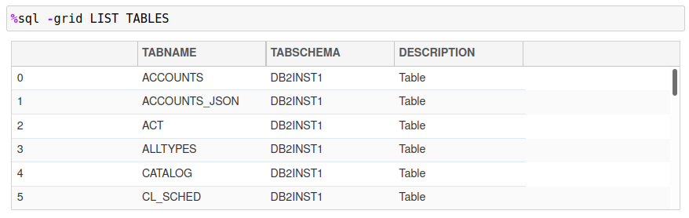
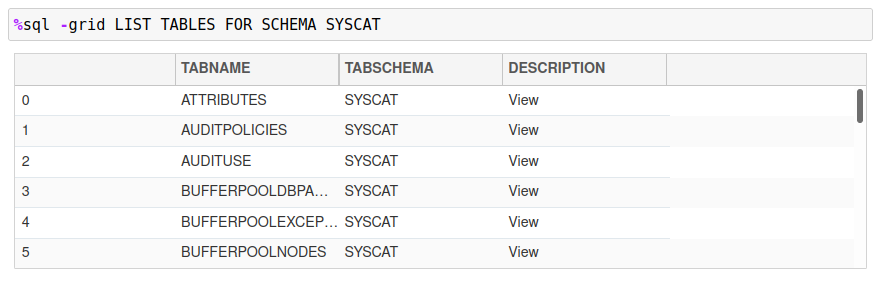
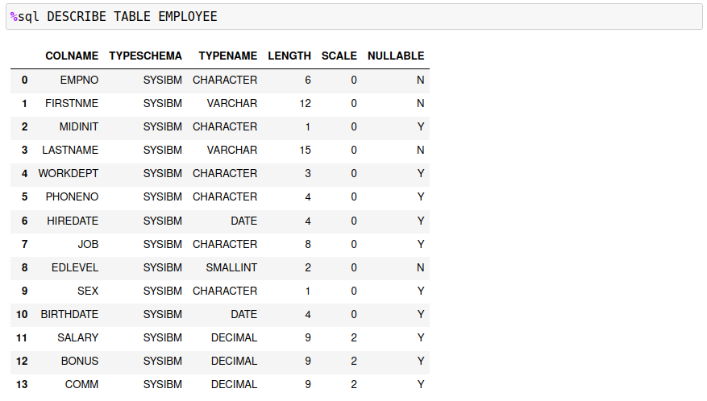

# Predefined SQL Macros

There are four `%sql` commands that are implemented as macros. These commands are:

* `SAMPLEDATA`
* `LIST TABLES`
* `DESCRIBE`
* `SET <option> <value>`

These commands would be used in the same way that SQL statement are executed, either in a `%sql` or `%%sql` block.

## Sample Data

Many of the examples that are used when learning Db2 revolve around the use of the `EMPLOYEE` and `DEPARTMENT` tables. Normally these tables would be created as part of the `SAMPLE` database. If you have direct access to the Db2 database, you can create the `SAMPLE` database with the following command. Note that you must be connected to the Db2 Instance and have a terminal (command line) window open.
```
db2sampl -sql -xml
```

There are additional options available for the [db2sampl](https://www.ibm.com/docs/en/db2/11.5?topic=commands-db2sampl-create-sample-database) command in the Db2 documentation.

If you are using another database, or do not have access to the `db2sampl` command, this macro will generate the `EMPLOYEE` and `DEPARTMENT` tables. The `SAMPLE` database contains many more tables, but these two form the basis for many SQL examples. To create these tables under your currently connected userid, issue the following command:
```
%sql SAMPLEDATA
```

This command will generate the two demonstration tables under the current schema. Note that if the `EMPLOYEE` or `DEPARTMENT` table are found, they will **not** be replaced or refreshed. This is to avoid over-writing tables that may have been generated with the `db2sampl` command.

## List Tables

The `LIST TABLES` command is useful when you are searching for the tables within in your database. The syntax for this command is:
```
%sql LIST TABLES [FOR SCHEMA schema]
```

Issuing the `LIST TABLES` without any arguments will produce a list of tables for the current schema.



If the `FOR SCHEMA schema` option is supplied, all tables for that schema will be displayed.



## Describe a Table

The `DESCRIBE` command will display the name, data type, length, scale, and nullability for all columns in a table. The syntax for the `DESCRIBE` command is:
```
%sql DESCRIBE [TABLE table] | [SELECT statement]
```

The simplest form of the command lists the columns of a table as shown in the example below.



The command is also useful when trying to determine the data types of an SQL statement. The following example illustrates how a calculation in a select list is returned in the answer set.


There is more detailed information displayed when you describe a `SELECT` statement.

## Set OPTIONS

The `SET` command can be used to set any of the Db2 magic options:

* `SET MAXROWS value`
* `SET MAXGRID value`
* `SET THREADS value`
* `SET DISPLAY value`

These commands can also be set using the `OPTION` keyword:

* `OPTION MAXROWS value`

You can use either form of the command. The `SET` command is what has been typically used for changing Db2 settings, so this aligns that practice.