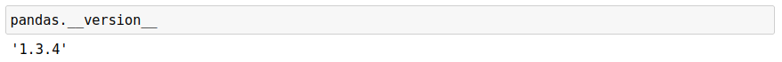
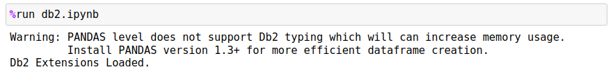
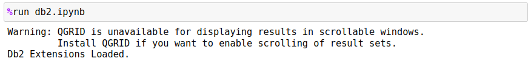
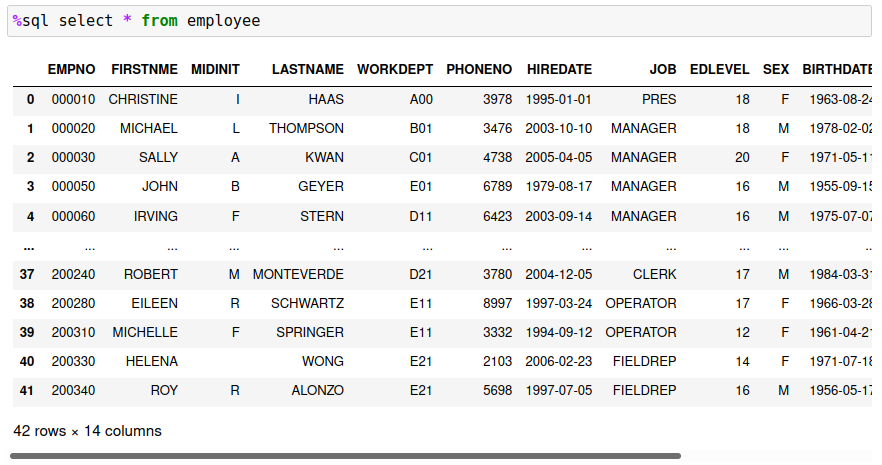
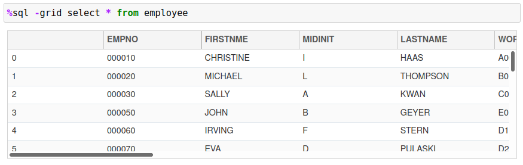
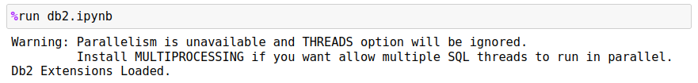
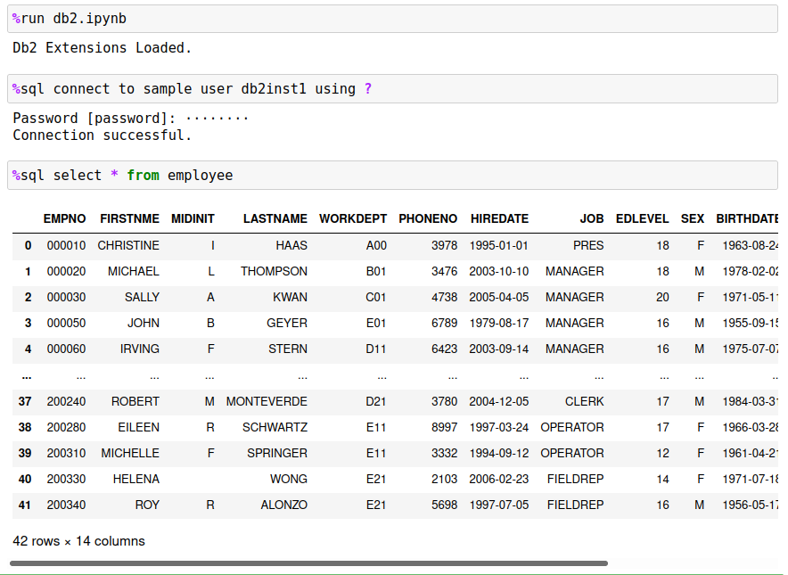

# Db2 Magic Commands Installation

## Pre-requisities

In order to use Db2 magic commands in your Jupyter notebook environment, you must have following pre-requisites:

- Jupyter notebooks with a Python 3+ interpreter
- IBM Python driver (ibm_db)
- Db2 LUW access 
- Optional: qgrid, pandas, multi-threading

The Db2 magic commands have been tested on Linux, UNIX, and Windows environments, but are not certified to run against Db2 for z, or Db2 for iSeries versions. This doesn't mean that they can't be adapted to work against these data sources, only that there has been no validation testing done against those target environments.

If you are using Watson Studio, or are using a Cloud Pak for Data system, the Db2 Python client will have already been installed. If not, you will need the system administrator to install this feature. The main project page for the Python client can be found [here](https://github.com/ibmdb/python-ibmdb).

If you have access to your Jupyter notebook environment, the Db2 Python client can be installed in one of three ways:

- `python3 -m pip install ibm_db` or `pip install ibm_db`
- `easy_install ibm_db`
- `conda install ibm_db` 

Prior to running the installation you may want to run these commands to ensure the proper libraries are available for the Db2 drivers:

- RHEL/CentOS `yum install python3-dev`
- Ubuntu `apt-get install python3-dev`

More detailed instructions can be found on the [Db2 Python Driver](https://github.com/ibmdb/python-ibmdb#inst) support page.

## Optional Components

There are three libraries that the Db2 magic commands load in and will use if available:

- Pandas dataframes 1.3 data type conversion
- QGRID Display 
- Multi-processing

### Pandas 1.3 Support

If your current version of Pandas is equal to 1.3 or greater, the Db2 magic commands are able to load data into a data frame using a more efficient storage representation. To check your Pandas version, run the following command inside a Jupyter code cell:

```
pandas.__version__
```

The result will be the release, version, and modification level of Pandas that you are currently running.



Normally the Pandas control will take Db2 strings and represent them as objects, and decimal numeric types and convert them to float. In the 1.3 release of Pandas, the type of data type can be explicitly set, and this will significantly reduce the amount of memory that Pandas requires to store the Db2 answer set. See [read_sql_query](https://pandas.pydata.org/pandas-docs/stable/reference/api/pandas.read_sql_query.html#pandas.read_sql_query) for more details of this feature. In the event you do not have a version that supports this feature, the Db2 magic commands will print a warning message.



### QGRID Display

The Db2 magic command will check to see whether or not you have the QGRID control installed in your Jupyter environment. If it is not available, it will print a warning message:



The default method of displaying result sets is to use Pandas formatting. For instance, the following result set is produced from querying the contents of the sample `EMPLOYEE` table:



The amount of data that is displayed is limited to 10 rows, with the first and last five rows being shown. There are ways to adjust the number of rows displayed and the settings are covered in another chapter. If you use install the [QGRID control](https://github.com/quantopian/qgrid), the results can be displayed in a scrollable windows:



The QGRID control allows you to scroll through the entire answer set rather than having to print the contents of Pandas dataframe. This makes it much easier for you to review the results of your queries rather than having without having to adjust the Pandas display limits.

To install the QGRID control, use one of the following options. For a non-conda installation use:

```
pip install qgrid
jupyter nbextension enable --py --sys-prefix qgrid
```

The following is only required if you have not enabled the ipywidgets nbextensions:
```
jupyter nbextension enable --py --sys-prefix widgetsnbextension
```

If you are using `conda` as the Jupyter notebook and Python distribution, use the following command:

```
conda config --add channels conda-forge
conda install qgrid
```

### Multi-processing

The Db2 magic command can split a query into multiple processes (independent of the Db2 LUW version). This technique is useful when a large amount of data needs to be retrieved, or if it is more efficient to search for rows based on a range of values. The multi-processing feature will initiate "x" number of processes, each running the same SQL with a specific range value. To the Db2 server this looks like "x" number of users requesting similar data. In effect you are forcing Db2 to do more work on your behalf! This doesn't change the performance of Db2 itself, but may allow Db2 to optimize the answer set for each thread and improve the speed of answer set retrieval. You should always check with the database administrator to verify that using multi-processing will not cause performance issues in the database.

When the Db2 magic command initializes, it will display a message if multi-processing is not available:



To install the multiprocessing package, use the following command:

```
pip install multiprocess
```

Details of the feature can be found [here](https://pypi.org/project/multiprocess/).

## Loading Db2 Magic Commands

Once you have `ibm_db` installed and any additional features, you will need to download the Db2 magic commands. The Db2 magic commands can be downloaded and placed directly to the directory that your Jupyter notebooks are stored in, or can be downloaded from within a Jupyter notebook.

To load the Db2 magic commands into your notebook, use the following syntax:
```
!wget https://raw.githubusercontent.com/IBM/db2-jupyter/master/db2.ipynb

```

Once you have loaded the Db2 magic commands into your notebook, you are able to query Db2 tables using standard SQL syntax:



The following sections will describe how to get started with the Db2 magic commands and how to become more productive when querying Db2 databases.