# SQL Magic Commands

The Db2 extension is made up of one magic command that works either at the LINE level (`%sql`) or at the CELL level (`%%sql`). Both versions of the `%sql` commands provide the ability to run Db2 SQL commands including:

* DCL - Setting permissions for database objects
* DDL - Creating or dropping database objects
* DML - Insert, update, delete, or select data from tables
* Administration - A subset of administration commands using the `ADMIN_CMD` function

The syntax of the `%sql` statement is:
```
%sql -options sql 
```

The syntax for `%%sql` is:
```
%%sql -options
sql 1
sql 2
...
```

The difference between the two `%sql` commands is that `%sql` only allows for a single statement to be executed, while the `%%sql` allows a block of SQL to be executed. 

## Line Command `%sql` 

In a Jupyter notebook, a code cell can contain Python code and magic commands. You can use the single line version of the `%sql` command along with Python code in a cell:

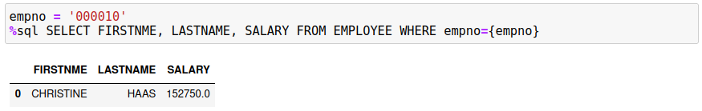

The entire SQL statement must be found after the `%sql` command. You can use two techniques to allow for larger SQL statements, but the major restriction is that only **one** SQL statement is executed.

To extend the SQL over multiple lines, use the Python `\` character as the last character of a string. This will allow you to continue the statement onto the next line:

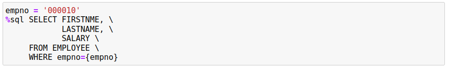

**Note:** Make absolutely sure that there are **no** characters, even spaces, following the `\` character, otherwise the statement will be terminated at that point.

The other option is to create a Python variable that contains the SQL string using triple quotes (`'''`,`"""`). If you are using variable substitution in the string then you must remember to use the `f"""` qualifier at the beginning of the string to ensure the variable substitution is done.

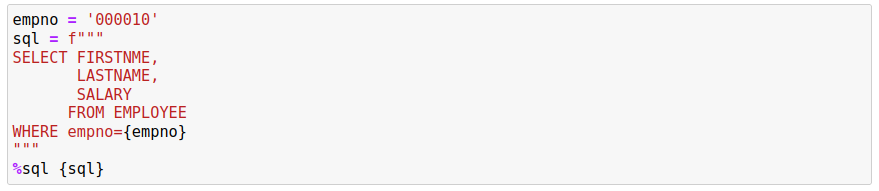

When using this technique to create the SQL statement, you do **not** need to use the continuation characters. This will simplify the creation of your SQL. 

In summary, the single line version of the `%sql` command can run a single SQL statement and can also coexist with Python statements in the same code cell.

## Cell Command `%%sql`

If you want to run a large SQL statement, or multiple SQL statements, then you must use the `%%sql` command. Note that when you use the `%%sql` form of the command, the entire contents of the cell is considered part of the command, so you cannot mix Python statements in the cell.

The following is an example of using the `%%sql` command:

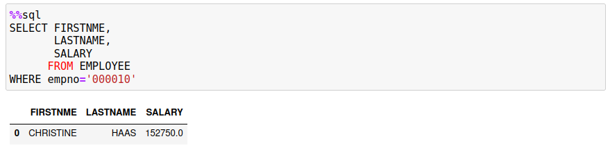

The cell contains only the SQL statement and nothing else. The previous `%sql` examples combined Python and the magic command. A `%%sql` cell block can contain more than one SQL statement:

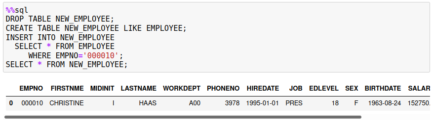

If there is more than one SQL statement in the block, you must terminate each statement with a semi-colon `;`. If you are creating stored procedures or functions, then you may need to change the delimiter to an at `@` sign by using the option `-d`.

```
%%sql -d
DROP TABLE NEW_EMPLOYEE@
CREATE TABLE NEW_EMPLOYEE LIKE EMPLOYEE@
```

## Output and Assignment Statements

The `%sql` and `%%sql` commands will generate output when a `SELECT` statement produces results. Both of forms of the command will display the results as a Pandas dataframe.

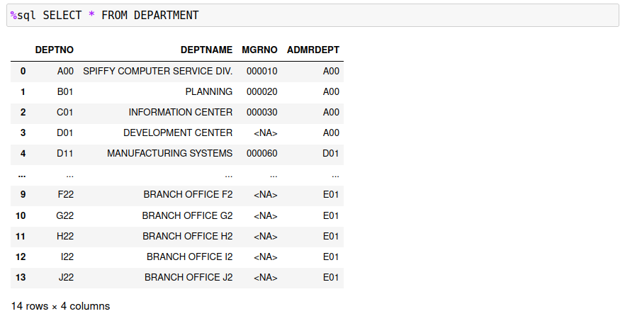

The `%sql` command provides the option of assigning the output to a Python variable:
```
results = %sql SELECT * FROM DEPARTMENT
```

The `results` variable will contain the answer set as a Pandas dataframe. You can use the various Pandas functions to manipulate the dataframe including the ability to display certain portions of the data, do calculations across ranges, and plot the data. 

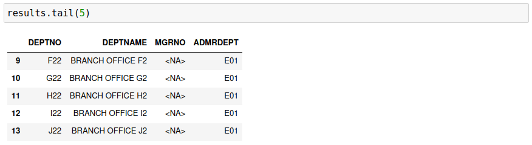

The ability to assign a result set to a Python variable is **only** available for the `%sql` command.

## Multiple Result Sets

When using the `%%sql` command, you could have multiple `SELECT` statements in your SQL:
```
%%sql
SELECT * FROM EMPLOYEE;
SELECT * FROM DEPARTMENT;
```

It's not recommended that you do this because of the way the dataframes are displayed. By default, the Db2 magic commands will display the results in the Pandas dataframe format. When you execute the above code, you will only see one result set displayed:

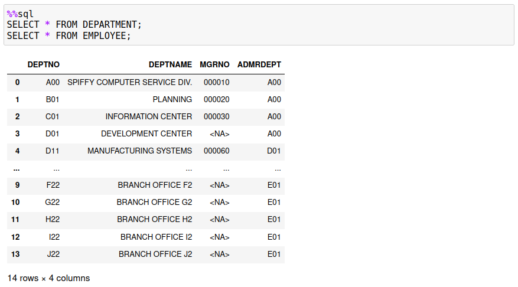

The first `SELECT` is the one that is always displayed. If you do want to see multiple result sets, you must use the `-grid` option and have the QGRID extension installed. If you use the `-grid` option, then the two answer sets will be displayed.

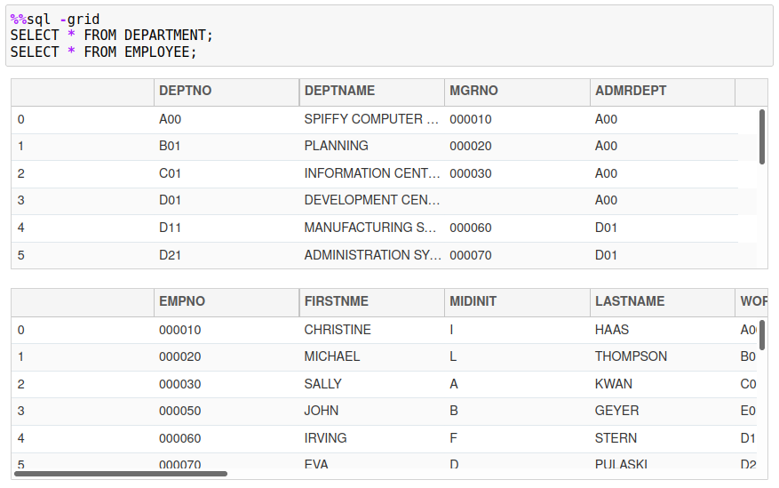

## Python versus Db2 Character Strings 

Character strings require special handling when dealing with Db2. The single quote character `'` is reserved for delimiting string constants, while the double quote `"` is used for naming columns that require special characters. You cannot use the double quote character to delimit strings that happen to contain the single quote character. What Db2 requires for single quotes in a string is to place two quotes in a row to have them interpreted as a single quote character. For instance, the next statement will select one employee from the table who has a quote in their last name: `O'CONNELL`.
```
%sql SELECT * FROM EMPLOYEE WHERE LASTNAME = 'O''CONNELL'
```

Python handles quotes differently! You can assign a string to a Python variable using single or double quotes. The following assignment statements are not identical!

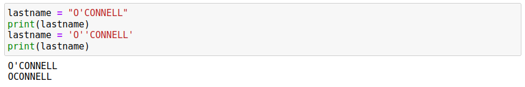

If you use the same syntax as Db2, Python will remove the quote in the string! It interprets this as two strings (`O` and `CONNELL`) being concatenated together. That probably isn't what you want! So the safest approach is to use double quotes around your string when you assign it to a variable. Then you can use the variable in the SQL statement as shown in the following example.

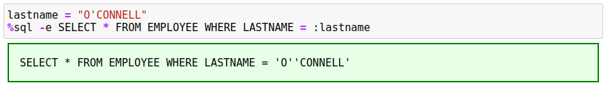

Notice how the string constant was updated to contain two quotes when inserted into the SQL statement. This is done automatically by the `%sql` magic command, so there is no need to use the two single quotes when assigning a string to a variable. However, you must use the two single quotes when using constants in a SQL statement. 

## Built-in Variables

There are four built-in variables that you have access to in your code cells. These pre-defined variables are:

* `sqlcode` - The `SQLCODE` returned by the last statement executed
* `sqlstate` - The `SQLSTATE` returned by the last statement executed
* `sqlelapsed` - The time taken to execute the last statement
* `sqlerror` - The error message associated with the `sqlcode` value

Normally these variables are used for application development, but you may find the `sqlelapsed` useful for timing SQL statements.


