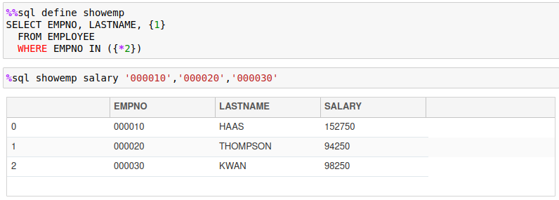
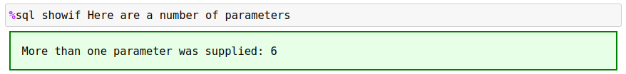

# Macros

The `%sql` command allows the use of user-defined macros. Macros can be used to generate frequently used SQL and simplify scripting. Macro substitution is done prior to any SQL being executed. Macros replace the text in the `%%sql` block with the SQL that is generated in the macro. For example, there are a number of commands that are available in Db2 magic that have been created as macros:

- LIST TABLES FOR SCHEMA 
- DESCRIBE TABLE x
- SAMPLEDATA
- SET OPTION VALUE

You can view the code in either the `db2.ipynb` notebook or the `db2magic.py` file.

## Macro Basics

A Macro command contains logic and SQL text that you want to have substituted into your script. The `%sql` command will execute any macros found in text first before attempting to run the SQL. The macro name must be the first keyword after the `%sql` command (ignoring any flags). For instance, the following `%sql` command would consider `LIST` as the macro name:
```
%sql LIST TABLES FOR SCHEMA DB2INST1
```
The `%sql` processor first checks to see if this first keyword has been defined as a macro. If not, it will process it as a regular SQL statement. 

Macros can be used in `%sql` lines or as part of a `%%sql` block. The contents of the macros are expanded and replace the text in the SQL block and then the SQL statements are executed. Macros are handled the same was as SQL statements. Anything that follows the macro name, up to the end of the SQL block, or a SQL delimiter (semicolon) are considered parameters of the macro.

For instance, the `LIST` macro in the above example assumes that everything following the `LIST` keyword is a parameter. In a `%%sql` block, the values up to a delimiter, or end of the block, are considered part of the macro:
```
%%sql
LIST TABLES
  FOR SCHEMA
  DB2INST1;
```

## Creating a Macro

To define a macro, the `%%sql define <name>` command is used. The body of the macro is found in the cell below the definition of the macro. This simple macro called `EMPTABLE` will substitute a SELECT statement into a SQL block.
```
%%sql define emptable
select empno, firstnme, lastname from employee
```
The name of the macro follows the `%%sql` define command and is **not** case-sensitive. To use the macro, we can place it anywhere in a `%sql` block. This first example uses the macro by itself.


The actual SQL that is generated is not shown by default. If you do want to see the SQL that gets generated, you can use the `-e` (echo) option to display the final SQL statement. The following example will display the generated SQL. Note that the echo setting is only used to display results for the current cell that is executing.


The DEFINE command will replace any existing macro with the same name. In addition, macros only exist within your notebook and will need to be recreated if you restart the notebook kernel or re-run the `%db2.ipynb` notebook. If you create another Jupyter notebook, it will not contain any macros that you may have created. If there are macros that you want to share across notebooks, you should create a separate notebook and place the macro definitions in there. Then you can include these macros by executing the `%run` command using the name of the notebook that contains the macros.

## Macro Parameters and Tokens

The text that follows the name of the macro is tokenized (split by spaces). In order to use any tokens that follow the macro name, you can refer to them in your macro body using the special sequence `{#}` where the number sign represents the nth token in the string. The tokens that are placed after the name of the macro can be any number, character string, or quoted string that is separated by blanks. Any number of parameters are permitted in a macro definition. For instance, the following string has 5 tokens:
```
LIST 1234 "Here's a string" AbCD-12 'String'
```
The tokens are `LIST`, `1234`, `"Here's a string"`, `AbCD-12`, and `'String'`. 

Tokens are numbered from 0 to n-1 where token number 0 (zero) is the name of the macro and 1 to n-1 (maximum of 9) are the tokens following the macro name. In the example above, token 0 is `LIST` while token 1 is `1234` and so on.

Quotes and brackets have special handling. Quotes will ensure that spaces inside the string will not split the string into multiple tokens. Note that spaces are used as delimiters. Values found between parenthesis `()` will be kept together as one value regardless of the spaces that are found. Parsing is relatively simple. If you have a string similar to the following, it will not observe SQL parsing rules.
```
LIST ("this is","parameter") FROM EMPLOYEE
```
The parser will generate the following tokens.

`LIST`, `( "this is" , "parameter" )`, `FROM`, `EMPLOYEE`

The values in parentheses are kept together even though there are spaces inside the brackets! 

From a macro perspective this means that any tokens that you want to pass to the routine needs to be kept relatively simple and separated with blanks or enclosed with parentheses. The following macro prints the employee ID, last name and salary based on an employee number list. The regular SQL would look similar to this:
```
SELECT EMPNO, LASTNAME, SALARY
  FROM EMPLOYEE
  WHERE EMPNO IN ('000010','000020','000030')
```
There are two ways of creating a macro to run this query. The first macro assumes that you will provide the name of the salary column as a parameter, and the employee numbers as a list in parentheses:
```
%%sql define showemp
SELECT EMPNO, LASTNAME, {1}
  FROM EMPLOYEE
  WHERE EMPNO IN {2}
```
To execute this query your SQL would be:


The other way to define the macro would be to supply the list of employee numbers as a comma-separated list and then have the macro body insert that into an IN list:
```
%%sql define showemp
SELECT EMPNO, LASTNAME, {1}
  FROM EMPLOYEE
  WHERE EMPNO IN ({*2})
```
To execute this query your SQL would be:



Either method will work, but the second example has the advantage of working with Python arrays. Db2 magic commands will unravel a Python array into a list of values. If you provide a Python variable to the macro, the value will be substituted into the macro. If the variable happens to be a list or tuple, the items will be entered as a string of values, each separated with a comma. 

For instance, the following commands will print the values `1,2,3`.


The `showemp` macro can use the same technique to select a list of employees based on the contents of a Python list or tuple.


### Using Token Lists

As described in the previous section, tokens are numbered from 1 to n, left to right as they are found in the statement. Tokens are delimited by blanks and quotes strings will have blanks ignored. The following macro has 5 tokens:
```
emptable lastname firstnme salary bonus '000010'
```
Token `{0}` refers to the name of the macro. Here is a macro that will select data from the EMPLOYEE table using the columns listed for a specific employee number:
```
%%sql define emptable
SELECT {1},{2},{3},{4} 
FROM EMPLOYEE
WHERE EMPNO = {5}
```
The results are shown below.


Using specific token numbers works fine if you know exactly how many tokens your SQL statement requires. In the previous example, exactly four columns are required in the answer set. What would happen if you wanted a variable number of columns to be returned in the answer set? You could add logic to the macro to provide this functionality, but it would need several `if` statements to cover all possibilities! The easier approach is to use a variable token list instead of a token number. The format of a variable token list is `{*x}` or `{,x}` where `x` refers to the token number where the list will begin. You can only have one token list in your macro and will always be at the end of your macro. When building a macro you would place the fixed tokens at the beginning of the macro definition and then the variable number of tokens will be found at the end. The `{*x}` will concatenate values with a blank between each value while `{,x}` will place a comma between each value.

The previous `emptable` macro could be rewritten as:
```
%%sql define emptable
SELECT {*2}
FROM EMPLOYEE
WHERE EMPNO  = {1}
```


## Macro Coding Overview

Macros can contain any type of text, including SQL commands. In addition to the text, macros can also contain the following keywords:

   * `#` - Comment (first character in the line)
   * `echo` - Display a message
   * `return` - Exit the macro but return any SQL that was generated
   * `exit` - Exit the macro immediately with no generated code
   * `if/else/endif` - Conditional logic
   * `var` - Set a variable
   * `flags` - Set flags to be used with the block

The only restriction with macros is that macros cannot be nested. This means you can't call a macro from within a macro. The sections below explain the use of each of these statement types.

### Comment

You can comment out lines or add documentation to your macros by placing a `#` symbol at the beginning of any line. The `#` symbol will only be recognized as a comment if there is nothing in front of it, otherwise it is considered part of the SQL you are generating.

The following is an example of a macro definition with some comments.


### Exit Command and Return Command

The exit command will terminate the processing within a macro and not run the generated SQL. You would use this when a condition is not met within the macro (like a missing parameter). The exit command can contain a message that will be displayed before terminating the macro.

The return command will also stop the processing of the macro but will return any generated SQL back for execution.
```
%%sql define showexit
echo This message gets shown
SELECT * FROM EMPLOYEE FETCH FIRST ROW ONLY
exit I just exited the macro
echo This message does not get shown
```

The macro that was defined will not show the second statement, nor will it execute the SQL that was defined in the macro body. Note that the echo command displays messages in green while the exit command displays it in red.


If we change the exit to a return, the SQL will be executed.


### Echo Command

As you already noticed in the previous example, the echo command will display information on the screen. Any text following the command will have variables substituted and then displayed with a green box surrounding it. The following code illustrates the use of the command.
```sql
%%sql define showecho
echo Here is a message
echo Two lines are shown
```
The echo command will show each line as a separate box.


If you want to have a message across multiple lines use `<br>` to start a new line.


### Var Command

The var (variable) command sets a macro variable to a value. A variable is referred to in the macro script using curly braces {name}. By default, the arguments that are used in the macro call are assigned the variable names `{0}` to `{n-1}`. The variable zero contains the name of the macro, while each token after the macro name is assigned to one of these numbered variables. There is also a system variable `{argc}` which contains a count of the number of tokens found (including the name of the macro).

To set a variable within a macro you would use the var command:
```
var name value
```
The variable name can be any name as long as it only includes letters, numbers, underscore _ and $. Variable names are case-sensitive so `{a}` and `{A}` are different. When the macro finishes executing, the contents of the variables will be lost.

A variable can be converted to uppercase by placing the `^` beside the variable name or number.
```
%%sql define runit
echo The first parameter is {^1}
```


The string following the variable name can include quotes and these will not be removed.
```
%%sql define runit
var hello This is a long string without quotes
var hello2 'This is a long string with quotes'
echo {hello} <br>{hello2}
```


When processing a macro, each one of the tokens is automatically assigned to a variable (1, 2, ..., n) and variable zero {0} is assigned the name of the macro. The following macro will be used to show how the tokens are passed to the routine.
```
%%sql define showvar
echo Token(1)={1} <br>Token(2)={2} <br>All={*0}<br>After Token 0={*1}
     <br>After Token 0 with commas={,1}<br>Count={argc}
```
Calling the macro will show how the variable names get assigned and used.


If the token does not exist, a `null` keyword will be shown. If you use `{*#}` then if no values are found and an empty string is returned.


Finally, any string that is supplied to the macro will include the quotes in the variable. The Hello There string will include the quotes when displayed:


The count of the total number of parameters passed is found in the `{argc}` variable. You can use this variable to decide whether the user has supplied the proper number of tokens or change which code should be executed.
```
%%sql define showvar
echo The number of unnamed parameters is {argc}.
```

The count of tokens does not include the name of the macro.


### If/Else/Endif Command

If you need to add conditional logic to your macro, then you should use the `if/else/endif` commands. The format of the `if` statement is:
```
if variable condition value
   statements
else
   statements
endif
```
The `else` portion is optional, but the block must be closed with the `endif` command. If statements can be nested up to 9 levels deep:
```
if condition 1
   if condition 2
      statements
   else
      if condition 3
         statements
      end if 
   endif
endif
```
If the condition in the `if` clause is true, then anything following the `if` statement will be executed and included in the final SQL statement. For instance, the following code will create a SQL statement based on the value of parameter 1:
```
if {1} = ""
   SELECT * FROM EMPLOYEE
else
   SELECT {1} FROM EMPLOYEE
endif
```

The `if` statement requires a condition to determine whether the block should be executed. The condition uses the following format:
```
if {variable} condition {variable} | constant | null
```
Variable can be a number from 1 to n which represents the tokens that are parsed during the macro call. So 
`{1}` refers to the first argument. The variable can also be the name of a named parameter.

The condition is one of the following comparison operators:

   * `=`, `==` : Equal to
   * `<` : Less than
   * `>` : Greater than
   * `<=`, `=<` : Less than or equal to
   * `>=`, `=>` : Greater than or equal to
   * `!=`, `<>` : Not equal to

The variable or constant will have quotes stripped away before doing the comparison. If you are testing for the existence of a variable, or to check if a token is empty, use the `null` keyword.
```
%%sql define showif
if {argc} = 0
   exit No parameters supplied
else
   if {argc} = "1"
       echo One parameter was supplied
   else
       echo More than one parameter was supplied: {argc}
   endif
endif
```
Running the previous macro with no parameters will check to see if the option keyword was used.


Now include one parameter.


Finally, issue the macro with multiple tokens.


One additional option is available for variable substitution. If the first character of the variable name or parameter number is the `^` symbol, it will uppercase the entire string.
```
%%sql define showif
if {1} <> null
   echo The first token is: {^1}
else
   echo You didn't supply a token
endif
```

The first parameter is converted to uppercase.


### Flags

When a macro is executed, flags that are found in the `%sql` line or block will be used during the execution of the macro. For instance, the `-e` (echo) flag will be set when the following macro is executed:
```
%sql -e showif
```

There are circumstances where you want the macro to run with certain flags set (e.g. `-q` to suppress error messages). In order to set flags during the execution of a macro, use the `flags` command:
```
flags -e -d ...
```

The flags that are provided in the list will be set during the execution of the macro. One situation where you must use the `flags` option is for SQL blocks that require the use the alternate delimiter `@` instead of a semicolon `;`.  Usually the `@` delimiter is required for stored procedures, functions, or SQL BEGIN blocks that include multiple SQL statements that must be delimited with semicolons. In this case, the `@` delimiter must be used to delimit the entire SQL block.