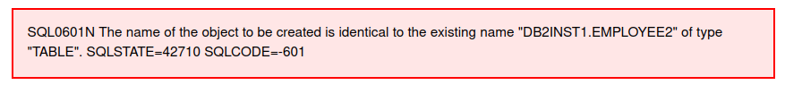
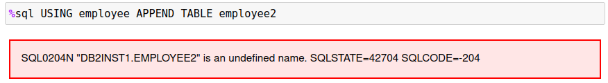
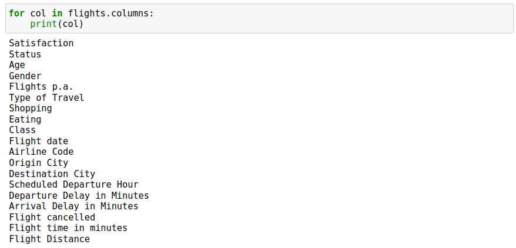
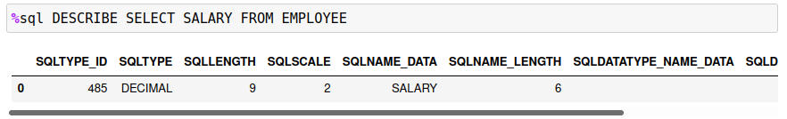
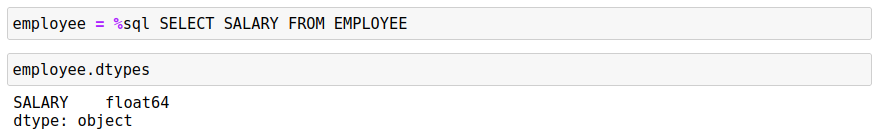
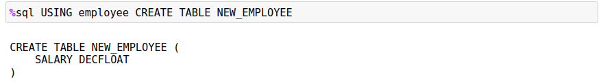

# Pandas to Db2

The primary purpose of the `%sql` command was to allow easy access to Db2 data from within a Jupyter notebook. However, there are situations where you may want to take the contents of a Pandas dataframe and move that into a Db2 table. There are multiple steps required to move the data from a dataframe to Db2 including:

* Determining the columns required, including the data types associated with them
* Creating the Table
* Inserting the contents of the dataframe into the table

In order to simplify the process of saving dataframe information, an extension to the SQL syntax has been added within the Db2 magic commands. The `USING` keyword in a SQL statement is used to trigger special handling of a dataframe. The syntax of the `USING` command is:
```
USING dataframe [CREATE | REPLACE | APPEND | DECLARE] TABLE <name> options 
```

The purpose of the `USING` command is to create a table based on the dataframe definition, and optionally insert the data into the table. There are additional options which determine how the table is created and whether data is loaded into the table. 

The `dataframe` value refers to the Python variable that contains the dataframe contents. Do not use the SQL variable format `:dataframe` or Python value substitution `{dataframe}` in the statement.

## Create, Replace, or Append a Table

The `USING` command has three different modes of operation:

* `CREATE` - Create the table based on the dataframe contents
* `REPLACE` - Recreate the table (delete the old one) based on the dataframe contents
* `APPEND` - Use the existing table definition and update the contents 
* `DECLARE` - Print the table definition only

After each one of these modes you must specify the name of the table. The table can be qualified with a SCHEMA name:
```
%sql USING df CREATE TABLE db2inst1.flights ...
```

If no options are found after the mode (`CREATE`,`REPLACE`), a table will be created with the dataframe column definitions:


The definition of the table is displayed underneath the command. If you believe that different data types should be used for the columns, then you can copy the command into another cell and recreate the table with the proper settings.

An error message will be displayed if you use the `CREATE` statement and the table already exists in the system.



In this case you should use the `REPLACE` option which will recreate the table for you. 

The `APPEND` mode will fail if the table has not been created. The best practice is to `CREATE` or `REPLACE` the table first and then use `APPEND`.



If the table does exist, `APPEND` will insert the data from the dataframe into the new table.

## Options

There are five options that can be specified after the mode:

* `WITH DATA` - Create the table and insert the data from the dataframe
* `LIMIT x` - Limit the amount of data loaded to `x` rows
* `COLUMNS ASIS` - Keep the column names as found in the dataframe instead of Db2-friendly names
* `KEEP FLOAT64` - Keep all float64 dataframe columns as is
* `KEEP INT64` - Keep all int64 dataframe columns as is


### With Data

With the `CREATE` and `REPLACE` modes, the table will be created, but no data will be inserted in the table. The `APPEND` mode assumes that you do want the data inserted so it does not require this option. When you specify the `WITH DATA` option, after creating the table the system will insert the data from the dataframe into the Db2 table.

When data is being loaded into the table, a progress indicator will appear underneath the table definition giving an indication of how many rows have been inserted into the table.


### LIMIT x

The `WITH DATA` option will tell the system to insert the data from the dataframe into the Db2 table. The `LIMIT x` option will stop the inserts after `x` number of rows. This may be useful if you only want to store a subset of data into the Db2 table, or if you want to make sure that the data is being properly inserted into the table. You can always test the insert process by using the following steps:


### COLUMNS ASIS

When the system attempts to create the Db2 table, it takes the column names in the dataframe and makes them Db2 compatible. This means that special characters and blanks are removed from the name and replaced with underscores. In addition, the names are converted to uppercase so that SQL statements do not have to delimit column names with double quotes `"`. 

The SQL standard allows column names to contain special characters, as long as they are delimited with double quotes. If a column name uses standard characters `A-Z,0-9,_`, then no quotes are required around the column name. There is also no need to worry about the case of the column names since all names will be folded to uppercase. 

The conversion of column names can be seen in the `flights.csv` data set. The columns in this CSV file are named:



During the conversion process, the columns are renamed:


The most notable change is the conversion of blanks to underscore `_` characters. If you do **not** want this conversion to occur, and keep the column names in their original format, use the `COLUMNS ASIS` option. This will cause the program to create the table with the exact column names of the dataframe without any changes. The `CREATE` example below illustrates how the column names are kept the same.


Note that this will make creating SQL queries slightly more challenging! If you want to query the flights per annum field, you will need to make sure you place the column name in quotes and have the correct spelling:
```
%%sql
SELECT * FROM MYFLIGHTS
  WHERE "Flights p.a." > 10
```

### KEEP FLOAT64, INT64

Pandas will often convert data into types that are larger than what is required. A good example of this is when a column with decimal or numeric values gets the data converted to float! The sample `EMPLOYEE` table illustrates this problem. A `DESCRIBE` of the `EMPLOYEE` table shows that the `SALARY` column is decimal.



When the dataframe is created from the `SELECT` statement, the data type for the `SALARY` column is `float64`.



When a table is created from this dataframe, the default behavior is to create a datatype that is closer to the values in the column. In this case the data is converted to `DECFLOAT` which is more suited to decimal numbers.



If you do not want `float64` or `int64` values to be converted to smaller datatypes, you must use the `KEEP FLOAT64` and/or `KEEP INT64` to keep the original values.
```
%sql USING employee CREATE TABLE NEW_EMPLOYEE KEEP FLOAT64 KEEP INT64
```