# Parallel SQL Execution

The Db2 magic commands provides a feature that lets you submit an SQL query using multiple processes. The SQL that you run in `%sql` and `%%sql` blocks are traditionally run in a single-threaded fashion. Each SQL statement is submitted to Db2 for processing and the remaining SQL does not get executed until the answer set has been retrieved for the SQL statement. Retrieving small answer sets (1000's to 10,000's of rows) is usually quick. If you need to return large amounts of data (1,000,000 of rows) then the network latency and retrieval time becomes a consideration.

What the Db2 magic command provides is the ability to split the SQL workload up into separate processes. Each process would run independent from the other processes. This technique would result in:

* Multiple threads running SQL independently from one another
* Multiple result sets being returned simultaneously  over the network
* Db2 running each SQL statement independently, resulting in higher Db2 utilization

The downside is that the Db2 system administrator may not like the additional workloads being run in the database! However, the SQL processing is being done on smaller chunks of data and may be able to take advantage of scans already in memory. In addition, this technique will provide a faster mechanism for returning the data to the workstation. 

There is some additional complexity on the part of the user. A suitable "range" condition needs to be provided so that the query can be parallelized. In addition, queries that involve averages, summarized information, etc... will not work since each thread is independent and the summarization will only be true for that slice. The final answer set is automatically collapsed into one dataframe so there is no need for the user to handle the results from multiple threads. 

## Enabling Multi-threaded SQL

The Db2 magic command checks at initialization time whether or not multiprocessing is enabled. If it is not, you will see a message similar to the following:


To install the multiprocessing package, use the following command:

```
pip install multiprocess
```

Details of the feature can be found [here](https://pypi.org/project/multiprocess/).

If multiprocessing is enabled, you will need to change the `THREADS` value to something between 0 and 12. For most cases a value between 4 and 8 should be sufficient. Only testing in your environment will determine what the best balance is for the thread count.
```
SET THREADS 4
```

This setting applies to all queries that will be run in multithreading mode. Traditional queries will not use this option so this can be set for your notebook, and it will not impact your normal SQL statements.

## Issuing Parallel SQL 

In order to run parallel SQL, you will need to use the following syntax:
```
%sql USING slice [SELECT | WITH] SQL statement ... WHERE slicecolumn = :slice
```

You can only parallelize `SELECT` statements. The `WITH` is also allowed since it refers to temporary table objects that will eventually be part of a `SELECT` statement. Any `INSERT`, `DELETE`, `UPDATE`, or `MERGE` command will be ignored. SQL statement that requires exclusive locks (`DELETE`, `UPDATE`, etc...) may cause one thread to block another thread causing deadlocks and performance issues. That is why this feature is limited to querying data only.

The variable that is used to parallelize the query (`slice`) must also be included in the SQL statement in the `WHERE` clause as an equality predicate `x=:slice`. 

### Slice Value

The value `slice` is a Python list (array) variable that contains the ranges you want to use during the execution of the SQL. The range does not have to be the same as the `THREADS` settings you used. The Db2 magic command will open up `x` threads and continue to execute the SQL query until all `slice` values have been used. 

The `slice` value could be a month, year, department, or any column that gives a discreet number of distinct values. For instance, the following `FLIGHTS` table has 19 different columns:

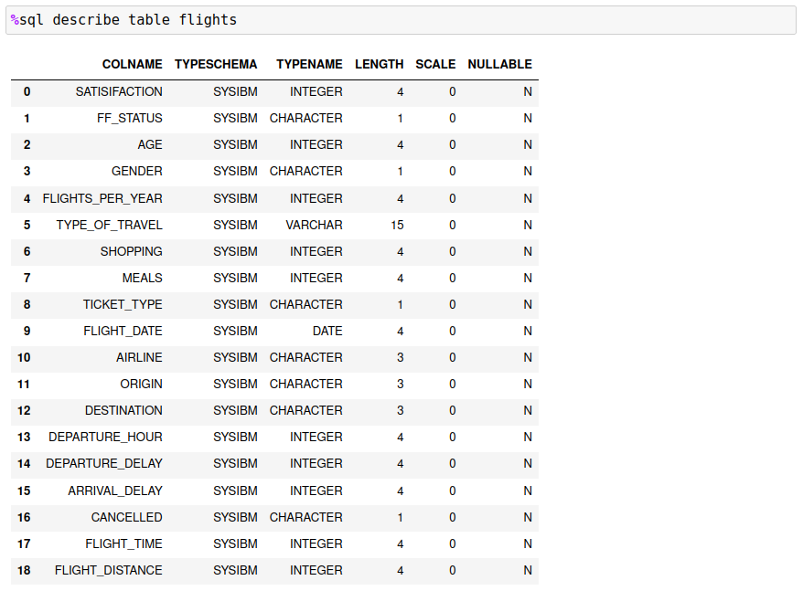

A few columns look like candidates to use for slicing the data: `FF_STATUS`,`FLIGHT_DATE`,`ORIGIN`,`AIRLINE`. Columns that are monetary or contain may hundreds of values are not good candidates. However, there are ways of generating discrete slices with ranges. This is covered in the next section.

If you are interested in the flights from 3 airports, you would create a slice based on the airport codes for those locations:
```
airports = ["DFW","AUS","IAH"]
```

Once you have determined your slice, you must add it to your SQL and the final command would be:
```
%sql USING airports SELECT ORIGIN, COUNT(*) FROM AIRPORTS WHERE ORIGIN = :airports
```

The Db2 magic command will take each value in the array `airports` and substitute it into the SQL statement (where the `:airports` value is) and then run it as a separate process. The results from each process will be combined together to create a final Pandas dataframe to display. The final result is shown below.

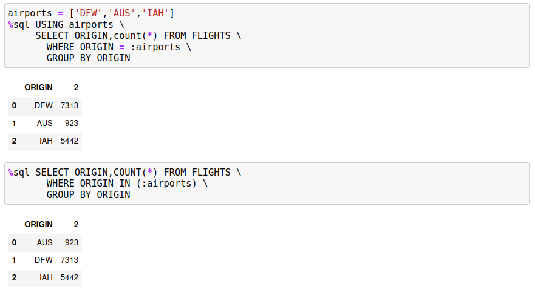

The good news is that both results are the same! The key point is that the slice that you use must be found in the `WHERE` clause in order for each answer set to be distinct. If you do want to use summary functions like `SUM` or `AVG`, then it must be restricted to the slice value, not to the entire answer set. The following example illustrates what could go wrong. Assume you want to get the average amount of money that passengers spend on meals in Texas airports. If we restrict this to the three airports `DFW`, `IAH`, and `AUS`, the SQL would be:

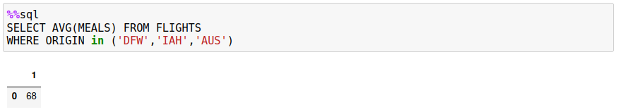

If this query was rewritten to use slices, the results would be different:

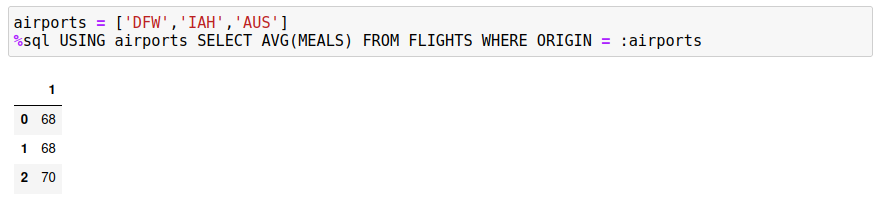

You could get the proper result by returning the count and sum of meals across the three airports, but then you would need to compute the average yourself.

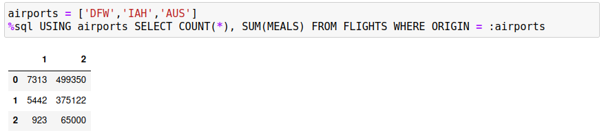

If you save the data into a dataframe, you can easily compute the average.

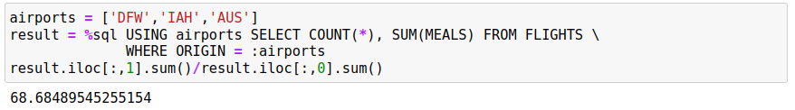

### Incorrect Slice Values

The values that are used for the slices should be of the same datatype. If not, one or more of the SQL statements may fail when executed. The program will capture the error when it occurs, but the SQL may have been run multiple times and used up resources for no reason. It is recommended that the SQL be prototyped on smaller values before running the query against the entire table.

The following query demonstrates what happens when one of the slices is incorrectly typed.

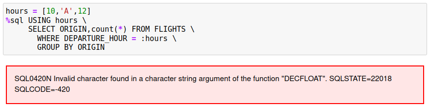

A simple check of the values could be done by running the SQL against a subset of the data:

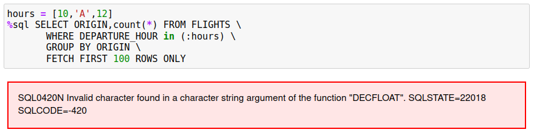

The clause `x = :slice` changes to `x IN (:slice)` and the `FETCH FIRST 100 ROWS` is added to limit the number of rows returned.

### Generating Slices

The `USING` clause requires that the user know what slices to use to parallelize the query. If a column has a large number of values, it may be easier to generate the slice using the following syntax. Assume that the column that you want to slice on is called `EMPNO`.
```
empno_list = %sql -r SELECT DISTINCT(EMPNO) FROM SOME_TABLE
```

The `empno_list` will contain an array of values (including the column names) of `EMPNO` values from the table. To generate an array of possible values to use in the `USING` clause, the following Python code is used:
```
empnos = [x[0] for x in empno_list[1:]]
```

Now that the slice values are available, the final query can be created.
```
%sql USING empnos SELECT * FROM SOME_TABLE WHERE EMPNO = :empnos
```

Here is an example of this technique being used to query a `FLIGHTS` table based on all of the `ORIGIN` airports.

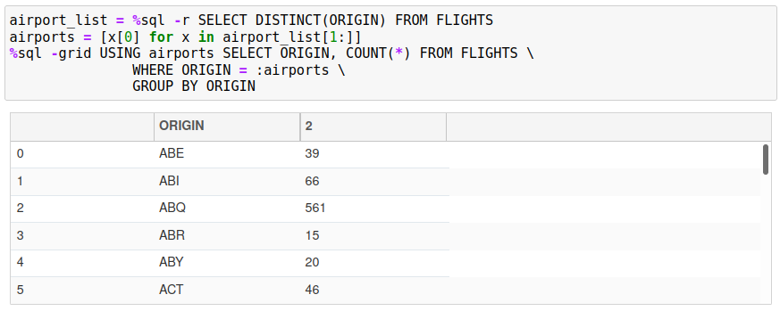

### Multi-value Slices

You may have situations where there isn't an exact value that can be used to represent the slice that you want to retrieve. For example, you may have range of values you want to use to represent a section of the data. You can use an array of arrays to achieve this. Similar to all of the other examples, you would create an array of values that you want to use.

One of the columns in our `FLIGHTS` table includes the departure hour. The following array creates four blocks of times that will be used to split up the query:
```
hours = [ [0,1,2,3,4,5],[6,7,8,9,10,11],[12,13,14,15,16,17],[18,19,20,21,22,23] ]
```

The final query is displayed below.

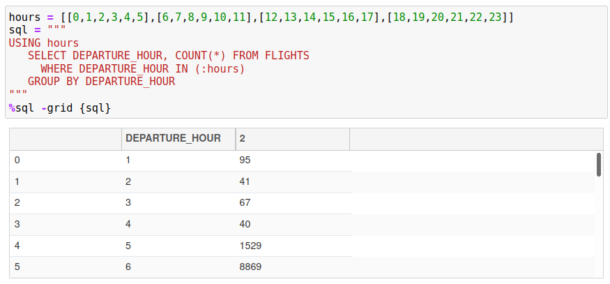

When using a slice that contains array values, you must use `COLUMN_NAME IN (:slice_name)` in your SQL rather than `COLUMN_NAME = :slice_name`. The value you are passing is a list of values so the only way to compare multiple values is through an `IN` list.

### SQL and Slice Debugging

If there is a situation where the answer set does not appear correct, or you are receiving an SQL error message, you may want to use the `-e` (echo) option to display the SQL that is generated in each slice. The `FLIGHTS` example in the previous section can be modified to display the SQL that is being used in the individual slices.

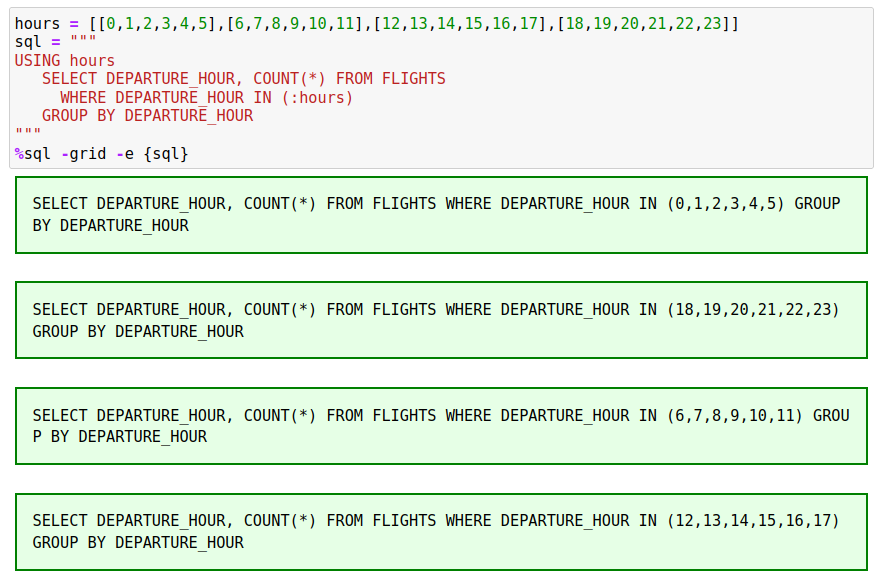

If you received an error message about invalid slice values, the `-e` option will usually show you the offending statement.

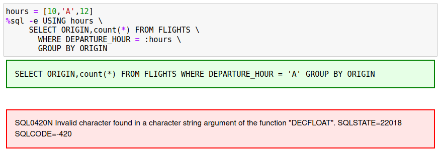

In this example, the value `'A'` is not compatible with the `DEPARTURE_COLUMN` datatype.