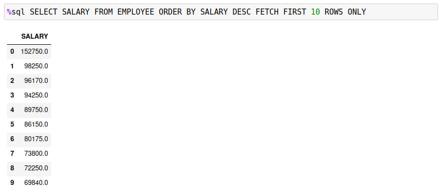
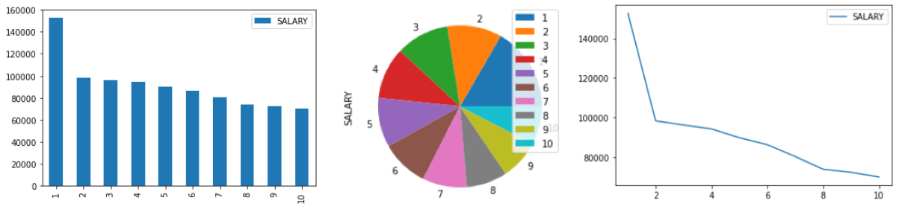
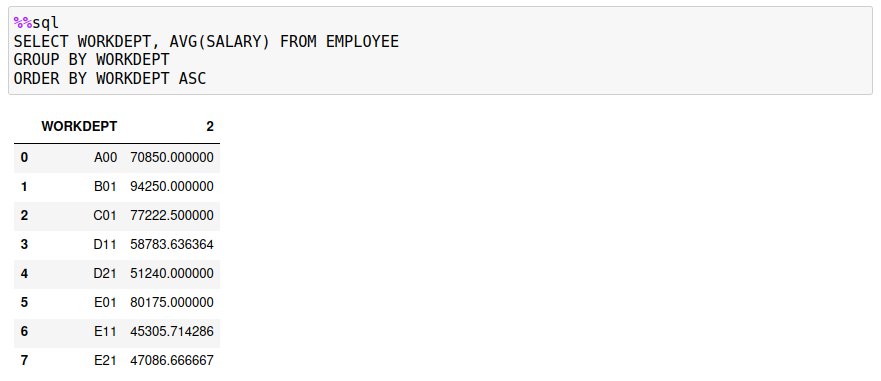
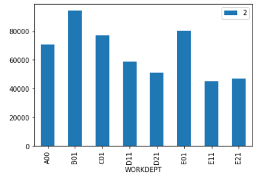
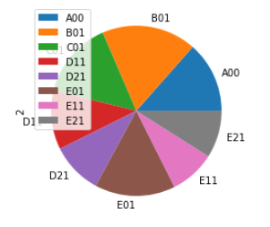
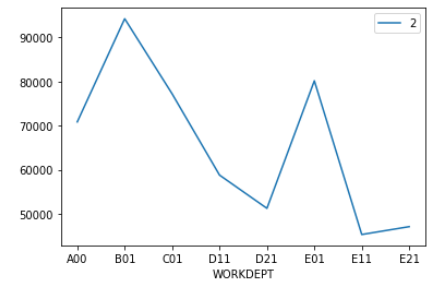

# Plotting

The Db2 magic commands include a very simplistic plotting feature. You may find other packages that provide much richer plotting capabilities using data from a Pandas dataframe. These plotting features are provided for quick plotting of data as either a bar, pie, or line chart. The first one or two columns of a result set must contain the values needed to plot the information.

The three possible plot options are:

* `-pb`, `-bar` - bar chart (x,y)
* `-pp`, `-pie` - pie chart (y)
* `-pl`,`-line` - line chart (x,y)

The following examples will use the `EMPLOYEE` table to demonstrate various plots. Here are the top 10 salaries in the table:

If a result set only returns one column, the pie, line, and bar charts will not have any labels associated with the data. The following display shows the employee data as a bar, pie, and line plot.

If you retrieve two columns of values, the first column is used for the labels (X axis or pie slices), and the second column contains the data. The SQL has been modified to return the average salary for each department.

A bar chart (`-bar`) uses the first column for the x-axis labels and the second column for bar values.

For a pie chart (`-pie`), the first column is used to label the slices, while the data comes from the second column.

For a line chart (`-line`), the first column contains the labels, and the second column is used for the values.

If you require more sophisticated plotting, then you may want to investigate the [Matplotlib](https://matplotlib.org/) library.