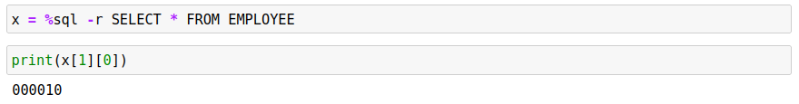

# Result Sets

By default, any `%sql` block will return the contents of a result set as a table that is displayed in the notebook. The results are displayed using a feature of Pandas dataframes. The following select statement demonstrates a simple result set.


You can assign the result set directly to a variable.
```
x = %sql SELECT * FROM EMPLOYEE FETCH FIRST 3 ROWS ONLY
```
The variable x contains the dataframe that was produced by the %sql statement, so you access the result set by using this variable or display the contents by just referring to it in a command line.


There is an additional way of capturing the data through the use of the -r flag.
```
x = %sql -r SELECT * FROM EMPLOYEE
```

Rather than returning a dataframe result set, this option will produce a list of rows. Each row is a list itself. The column names are found in row zero (0) and the data rows start at 1. To access the first column of the first row, you would use `x[1][0]` to access it.



The number of rows in the result set can be determined by using the length function and subtracting one for the header row.


If you want to iterate over all of the rows and columns, you could use the following Python syntax instead of creating a for loop that goes from 0 to 41.


If you don't want the header row, modify the first line to start at the first row instead of row zero.
```
for x in rows[1:]:
```

The string format function `f"{line}"` converts values into strings as required. If you are using the data as input into other functions, make sure to convert the values to the proper types (`str()`), otherwise you may risk getting syntax errors in your code. For example, the `EDLEVEL` column in the `EMPLOYEE` table is a number and concatenating this to a string will fail due to a conversion error. 