# SQL Options

Both forms of the `%sql` command have options that can be used to change the behavior of the code. For both forms of the command (`%sql`, `%%sql`), the options must be on the same line as the command:
```
%sql -e ...
%%sql -e
```

The only difference is that the `%sql` command can have SQL following the parameters, while the `%%sql` requires the SQL to be placed on subsequent lines.

There are a number of parameters that you can specify as part of the `%sql` statement.

  * `-d` - Use alternative statement delimiter @
  * `-q`,`-quiet` - Suppress messages
  * `-j` - JSON formatting of the first column
  * `-json` - Retrieve the result set as a JSON record
  * `-a`,`-all` - Show all output
  * `-r`,`-array` - Return the results into a variable (list of rows)
  * `-e`,`-echo` - Echo macro substitution  
  * `-h`,`-help` - Display help information
  * `-line`,`-bar`,`-pie` - Plot data
  * `-grid` - Display results in a scrollable grid

Multiple parameters are allowed on a command line. Each option should be separated by a space:
```
%sql -a -j ...
```

The sections below will explain the options in more detail.

### Delimiters `-d`

The default delimiter for all SQL statements is the semicolon `;`. However, this becomes a problem when you try to create a trigger, function, or procedure that uses SQLPL (or PL/SQL). Use the `-d` option to turn the SQL delimiter into the at `@` sign. The semicolon is then ignored as a delimiter.

For example, the following SQL will use the @ sign as the delimiter.
```
%%sql -d
DROP TABLE STUFF
@
CREATE TABLE STUFF (A INT)
@
INSERT INTO STUFF VALUES
  1,2,3
@
SELECT * FROM STUFF
@
```

The delimiter change will only take place for the statements following the `%%sql` command. Subsequent cells in the notebook will still use the semicolon. You must use the `-d` option for every cell that needs to use the semicolon in the script.

### Display all results `-a`,`-all`

The default number of rows displayed for any result set is 10. You have the option of changing this option when initially connecting to the database. If you want to override the number of rows displayed, you can either update the control variable, or use the `-a` option. The `-a` option will display all rows in the answer set. For instance, the following SQL will only show 10 rows even though we have several rows in the table.

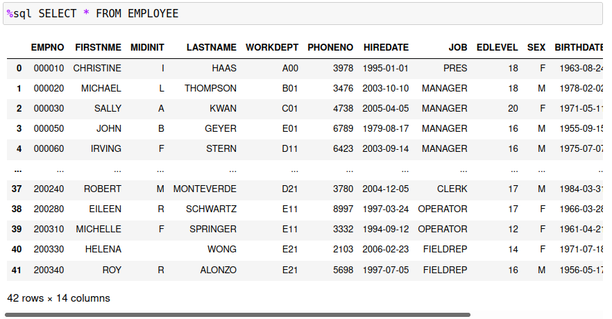

You will notice that the displayed result will split the visible rows to the first 5 rows and the last 5 rows. Using the `-a` option will display all values. The display has been cut off, but all 41 values are displayed.

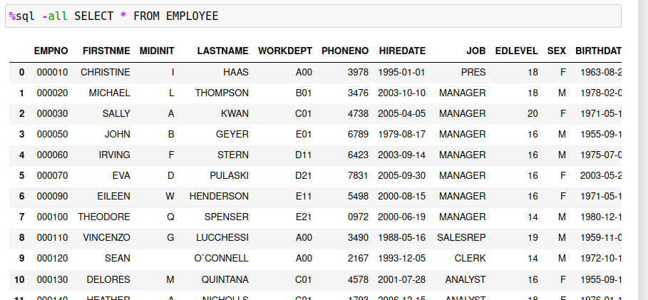

If you want a scrollable list, use the `-grid` option which is described in the next section. You can also change the number of rows that are displayed by default by using the `MAXROWS` option.

### Grid Display `-grid`

When output is produced in Pandas format, the size of the result set will be limited to a subset of the total number of rows. If you want to view all rows returned by the SQL, then you may want to use the `-grid` option. In order to use this feature, you must have the `ipydatagrid` library installed on your system. See the prerequisites section on details of this feature.

Using the `-grid` option will display an answer set in a scrollable grid within the notebook:

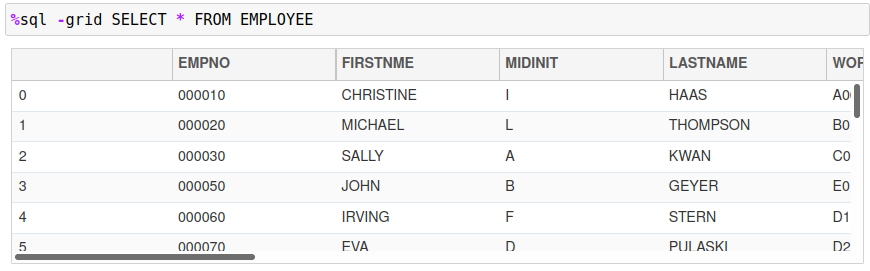

You can use the scroll bars in the display to see additional columns or rows of the answer set. The ipydatagrid display also allows for the sorting of the result sets by ascending or descending order by clicking on a column name. 

**Note**: The ipydatagrid control cannot display result sets that have duplicate columns names. For instance, the following SQL query is returned in the following Pandas format:

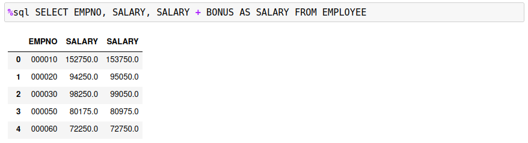

The original SALARY column is not shown in the ipydatagrid display. The last SALARY calculation (SALARY + BONUS) is what is displayed. Attempting to use the ipydatagrid control will result in only one column being displayed.

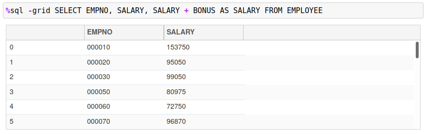

This situation can occur when you join two tables together and select columns from both. If there are columns with the same name, then the last column in the SELECT list with that name will be displayed.

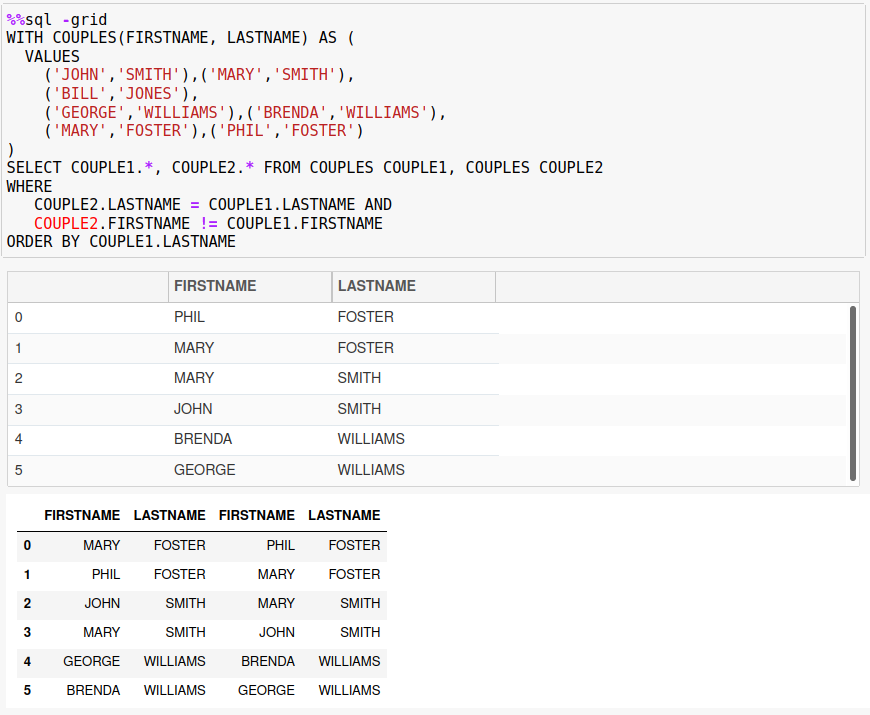

### Quiet Mode `-q`

Every SQL statement will result in some output. You will either get an answer set (SELECT), or an indication if the command worked. For instance, the following set of SQL will generate some error messages since the tables will probably not exist:

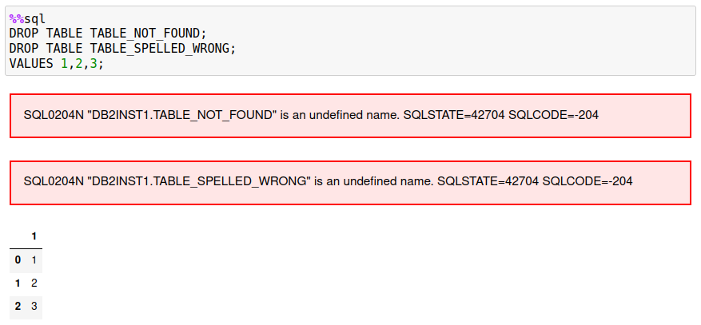

If you know that these errors may occur, you can silence them with the `-q` option.

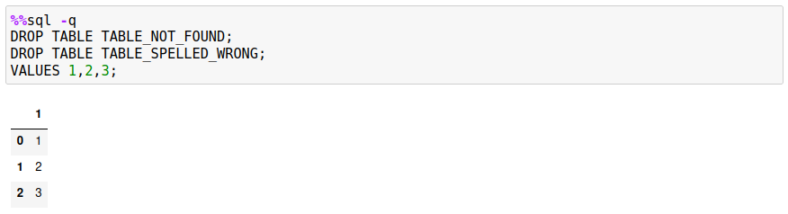

SQL output will not be suppressed, so the `VALUES` clause will still display results.

### JSON Formatting of First Column `-j`

If you are retrieving JSON data from a Db2 table, you have the option of storing it as a character string in Pandas or converting it into a dictionary in Python. Normally an SQL statement with JSON data would just be retrieved as a character string.

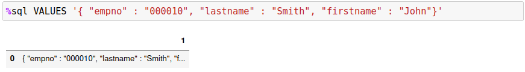

If you use the `-j` option, the program will convert the row(s) into an array of dictionaries. Usually you would use the assignment statement and the `%sql` command when using this option.

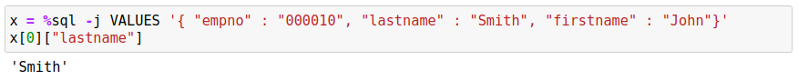

The following example illustrates multiple rows being returned and queried.

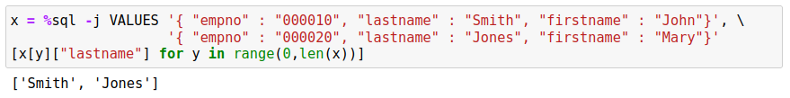

### Retrieve Rows as JSON Records `-json`

The previous JSON option `-j` was used to convert the first column of an answer set into a Python dictionary. The `-json` flag will take the answer set and create one dictionary entry for the contents of the row. This function is useful when you need to pass the contents of the result set to a system that requires the data in JSON format.

The following example retrieves the `EMPLOYEE` data for employee `000010` as a JSON record:

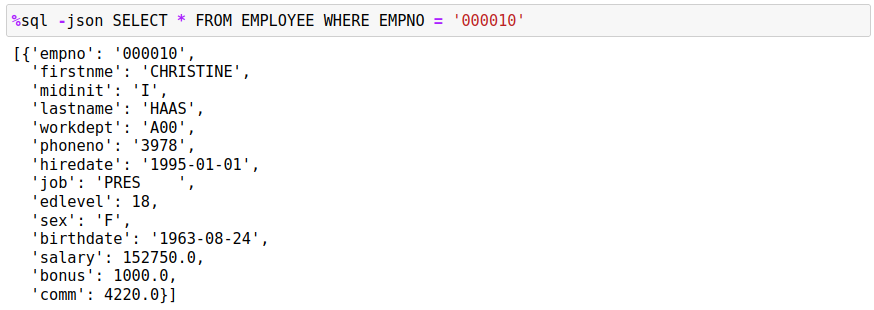

The data is always returned as an array of JSON values with each column value in the JSON record tagged with the column name (in lower case).

### Retrieve Data as a List `-r`,`-array`

The default storage format of a SQL result set is a Pandas dataframe. If you need to manipulate the result set as a Python list, then the `-r` or `-array` option needs to be used. The data being retrieved will be converted to a conventional Python list and can be printed or assigned to a variable.

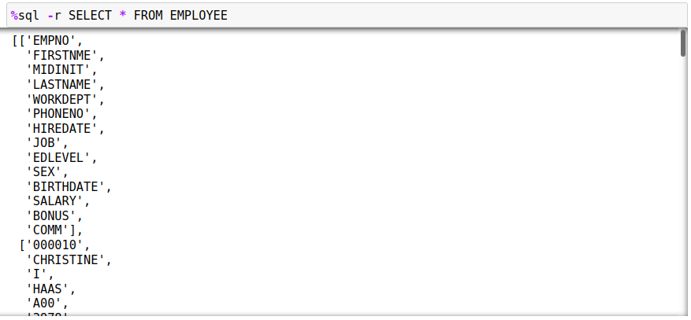

The first row (0) will contain the names of the columns being returned, while the remainder of the rows will contain the data. To refer to a row in the answer set you would use `answer[x][y]` where `x` is the row (starting at 1) and `y` referring to the column (starting at 0).

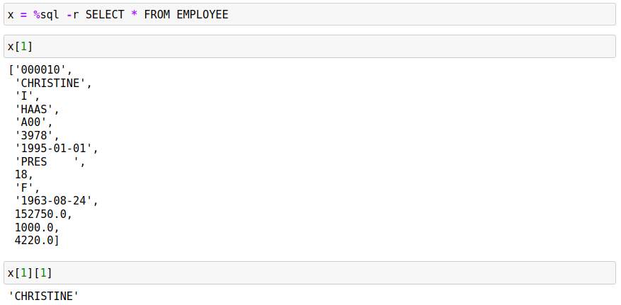

### Echo SQL `-e`

The echo command `-e` will display the contents of the SQL command after all substitutions have been done. The echo command is useful when debugging your SQL when you appear to be getting incorrect results. For example, the following SQL will fail with an end-of-statement error which isn't that useful at determining what went wrong!

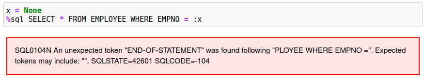

Adding the `-e` option to the SQL will confirm that the variable that was used in the SQL statement did not have a proper value assigned to it.

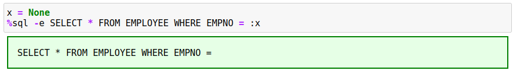

### Plot Data `-line`, `-pie`, `-bar`

The three plotting options (`-line -pie -bar`) are used to create simple plots of data. There is an entire section in the documentation that will cover the basics of using these plotting options.

### Display Help `-h`,`-help`,`?`

When the `%sql` command is issued with the `-h` option, a link to the online documentation will be produced as output. Clicking on the link will result in the help manual being displayed in another browser tab or window.

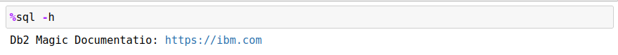
