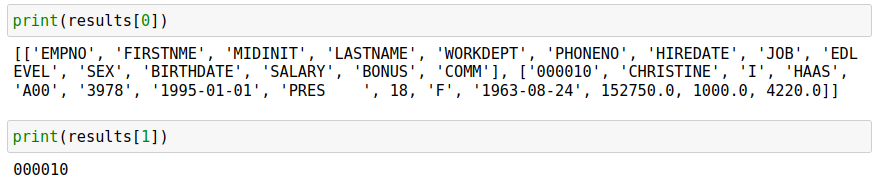
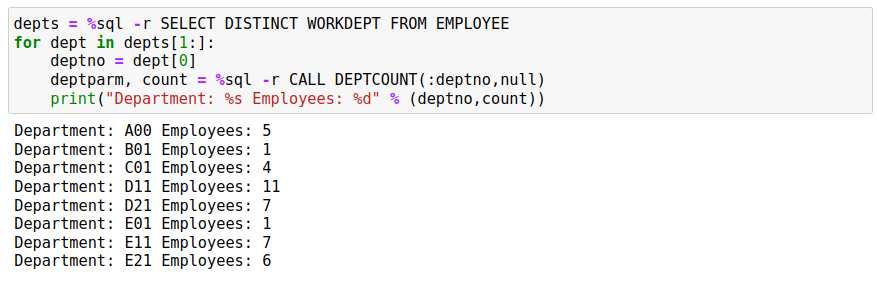

# Stored Procedures

The `%sql` command supports calls to stored procedures, but there are limitations to how it is used. The following restrictions apply:

* Only one answer set (cursor) is available from the stored procedure
* Accessing output values from the procedure requires the use of the `-r` (raw) flag
* Output is available either as a pandas dataframe, or as an array

The following stored procedure returns the first and last name of all employees. There are no parameters passed to the procedure.

Some important points about the stored procedure itself:

* The procedure must declare that there are answer sets with the `DYNAMIC RESULTS SETS` clause
* A cursor must be declared and then left open

If you create more than one cursor, only the first one will get processed by the routine.
```
%%sql -d
CREATE OR REPLACE PROCEDURE SHOWEMP
DYNAMIC RESULT SETS 1
begin
    DECLARE c1 CURSOR WITH RETURN TO CALLER FOR
       SELECT FIRSTNME, LASTNAME FROM EMPLOYEE;
    OPEN c1;
end@
```

Calling the stored procedure is done using the standard `SQL CALL procname(arguments)` format. There are specific rules for supplying arguments to a stored procedure:

* The CALL command is supported in a `%sql` statement only. It cannot be used as part of a `%%sql` block.
* Null arguments must use the `null` keyword, rather than the Python `None` equivalent.
* Brackets `()` are not required for stored procedures that have no arguments.

The next statement will execute the stored procedure and display the results by default.


Adding the `-a` (all output) flag to a stored procedure call will display all results. This is the same behavior when running regular SQL statements. If you want to assign the result to a variable, you only need to add an assignment statement to the SQL.


The use of the `-r `(raw output) flag will force the output to be converted into a two-dimensional array. The first line of th array will contain the column names, while the remainder will have the results in it. This format is useful if you want to write an application in Python to manipulate the data.
```
%sql -r CALL SHOWEMP
```

The stored procedure is now modified to accept a single argument which is the employee number. The employee number is supplied to the stored procedure and one record is returned with all of the details of the employee.
```
%%sql -d
CREATE OR REPLACE PROCEDURE SHOWEMP(in inempno char(6))
DYNAMIC RESULT SETS 1
begin
    DECLARE c1 CURSOR WITH RETURN TO CALLER FOR
       SELECT * FROM EMPLOYEE WHERE EMPNO=inempno;
    OPEN c1;
end@
```

When calling this procedure we must supply the employee number as a 6 character field. The behavior will be similar to the first example with no parameters.


If you use the standard `%sql` command without the `-r` parameter, only the answer set will be returned or displayed. An assignment statement with `-r `is slightly more complex:

* The first value will be the array of results
* Subsequent values will be the input/output parameters of the stored procedure 

The next SQL statement will assign the results to a single variable.

```
results = %sql -r CALL SHOWEMP('000010')
```

The first value in the results array (`results[0]`) is the answer set array, while the subsequent values are the parameters that are passed (or returned) by the stored procedure. `results[1]` will be equal to the employee number we were searching for.


The use of the `-r `flag becomes mandatory when you are retrieving an answer set from a stored procedure, and also need to access the return results of the arguments to the stored procedure. SQL stored procedures can have input, output, and input/output values. These values are returned back via the `%sql` command but can only be accessed when you use the `-r` flag.

The following stored procedure will return the employees in a department and also a count of the records found.
```
%%sql -d
create or replace procedure showdept(in indeptno char(3), out rowcount int)
DYNAMIC RESULT SETS 1
begin
    DECLARE c1 CURSOR WITH RETURN TO CALLER FOR
       SELECT * FROM EMPLOYEE WHERE WORKDEPT=indeptno;
    set rowcount = (SELECT COUNT(*) FROM EMPLOYEE WHERE WORKDEPT=indeptno);
    OPEN c1;
end@
```

A normal call to this stored procedure (no flags) will return the result set. Note we must supply the second parameter here but do not supply a value since it is an output value. The `null` keyword must be used.


To access the value of the rowcount, the `-r `flag must be used and the results assigned to a variable.


The first value of the `results` array will the answer set as an array. The second value will be the department that we requested, and the third will be the rowcount.

An alternative way of accessing the results is to create an assignment statement with the answer set and all of the parameters supplied. The following SQL will assign the answer set and parameters directly to variables rather than an array.


Stored procedures without answer sets will always return the parameters or `None` if nothing was supplied. This simple stored procedure increments the number that was sent to it.

## Stored Procedure Parameters

Stored procedures can have variables passed as parameters. To pass a parameter to a stored procedure, place a colon (:) in front of the variable name:
```
%sql CALL SHOWDEPT(:deptno,null)
```

The python variable `deptno` will be substituted into the `CALL` statement when it is executed.
```
%%sql -d
CREATE or REPLACE PROCEDURE DEPTCOUNT(in indeptno char(3), out rowcount int)
begin
    set rowcount = (SELECT COUNT(*) FROM EMPLOYEE WHERE WORKDEPT=indeptno);
end@
```

The following code will go through each department number and get a count of employees by calling the stored procedure. Note that an answer set return using raw format always returns an array of rows, and each row itself is made up of an array of columns. The code needs to iterate across the rows and then across the columns. The first row of the answer set is the column names, so we skip that by using `depts[1:]` as the starting point.


## System Stored Procedures

The Db2 System Stored procedures work using this syntax except for procedures that return binary XML output. At this point in time there is a limitation in retrieving this data using the Python Db2 API calls that are available. An example of a working procedure call is the `REORGCHK` procedure.
