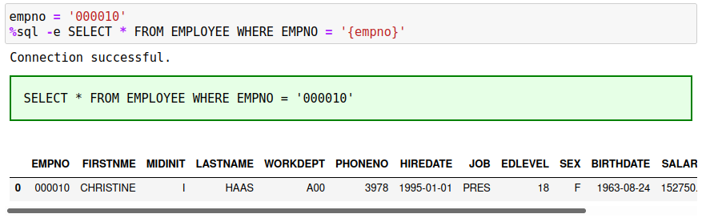
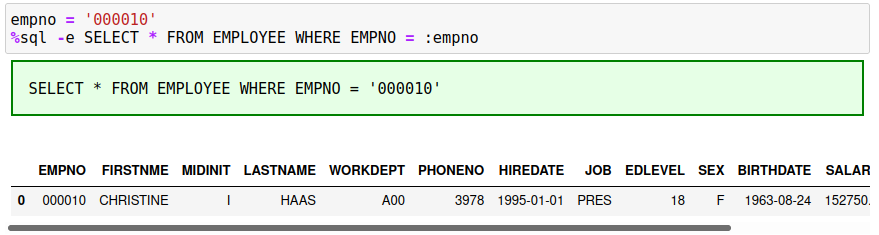

# Variables

The `%sql` and `%%sql` statements allow the use of variables within the SQL. This provides some flexibility in the writing your SQL so that you don't need to change the code when you modify one of the search values.

There are two ways of passing a value to a SQL statement:

* Use Python notation `{variable}`
* Use SQL host variables `:variable`

## Python Variables

The Python variable notation can only be used in single-line `%sql` statements, while the use of parameter markers is used in either style of SQL statement. The following SQL statement will illustrate the use of variables to modify the SELECT statement:
```
%sql SELECT * FROM EMPLOYEE WHERE EMPNO = {empno}
```

The `{empno}` field refers to the Python variable called `empno` and the contents of that variable will be substituted into the statement before execution. The code that you would place into your notebook cell would be:
```
empno = '000010'
%sql SELECT * FROM EMPLOYEE WHERE EMPNO = {empno}
```

By echoing the command, we can see that the substitution was done before the SQL was executed:


You will note that the employee number is `000010` in the SQL. Luckily, Db2 interpreted the `EMPNO` in the employee records as a number and compared it to the number that was supplied and was able to find a record match. When you are using Python variable substitution, you must make sure to place quotes around character strings that you need to supply to the SQL. Without quotes, it is possible that the variable will be misinterpreted. To fix this situation, place quotes around the variable as shown in this SQL.



## SQL Host Variables

SQL Host variables are similar to Python variables, where the name of the variable is imbedded in the SQL statement. The difference with parameters markers is that the variable name is preceded with a colon `:` and can be found in single line `%sql` statements as well as in `%%sql` blocks.

The employee number example in the previous section can be written as follows:
```
%sql SELECT * FROM EMPLOYEE WHERE EMPNO = :empno
```

In the case of host variables, the Db2 magic command will determine that this is a character string and will place quotes automatically around the variables. You do not need to supply quotes when using this form of parameter substitution.



The host variable can also be used in a `%%sql` block:
```
%%sql
SELECT * FROM EMPLOYEE
  WHERE EMPNO = :empno
```

## Arrays and IN Lists

Variables can also be array types. Arrays are expanded into multiple values, each separated by commas. This is useful when building SQL IN lists. The following example searches for 3 employees based on their employee number.

```
empnos = ['000010','000020','000030']
%sql SELECT * FROM EMPLOYEE WHERE EMPNO IN (:empnos)
```

Note that you must place parenthesis around the variable. SQL requires that the `IN` list be surrounded by parenthesis. 

You can reference individual array items using this technique as well. If you wanted to search for only the first value in the empnos array, use `:empnos[0]` instead.


## Dictionary Values

One final type of variable substitution uses Python dictionaries. Python dictionaries resemble JSON objects and can be used to insert JSON values into Db2. For instance, the following variable contains company information in a JSON structure.
```
customer = {
    "name" : "Aced Hardware Stores",
    "city" : "Rockwood",
    "employees" : 14
}
```

The following SQL creates a table with a single VARCHAR column that will be used to store the JSON data.
```
%%sql
DROP TABLE SHOWJSON;
CREATE TABLE SHOWJSON (INJSON VARCHAR(256));
```

To insert the Dictionary (JSON Record) into this Db2 table, you only need to use the variable name as one of the fields being inserted.
```
%sql INSERT INTO SHOWJSON VALUES :customer
```
Selecting from this table will show that the data has been inserted as a string.


If you want to retrieve the data from a column that contains JSON records, you must use the `-j` flag to insert the contents back into a variable.


The data that is returned when using the `-j` flag will always be an array even if the answer set is one row. 